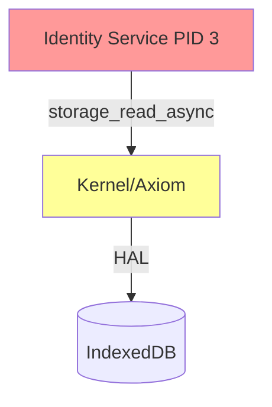
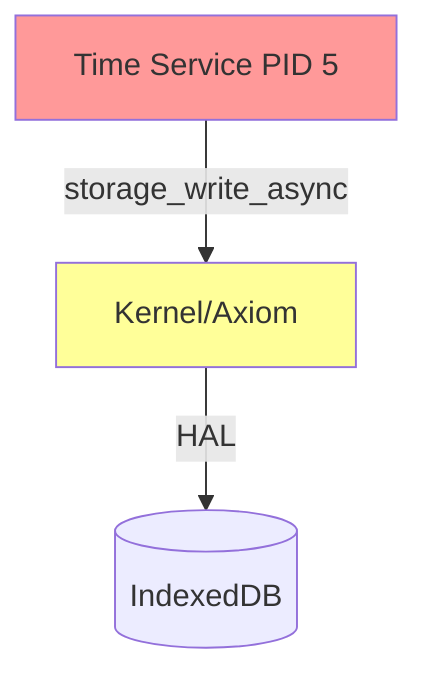
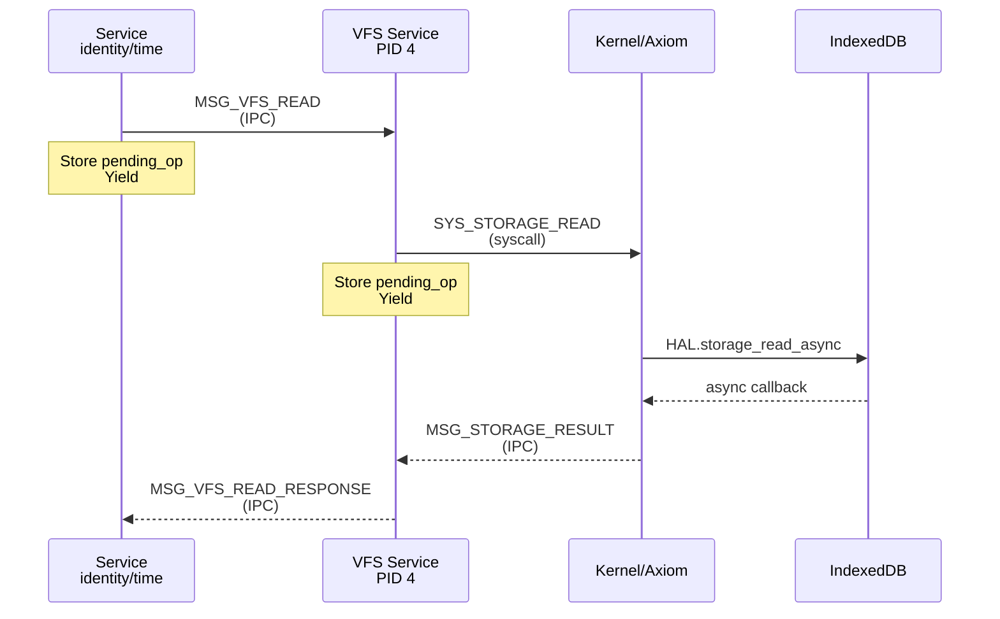

# Fix Storage Access Hierarchy Invariant Violations

## Current State

Two system services violate **Invariant 31 (Storage Hierarchy Enforcement)** by calling storage syscalls directly instead of using the VFS IPC protocol:

### Violation 1: Identity Service

**Location:** [`crates/zos-apps/src/bin/identity_service/service.rs`](crates/zos-apps/src/bin/identity_service/service.rs)

**Direct syscall usage (lines 41, 66, 92, 116, 140):**

- `syscall::storage_read_async()` (line 41)
- `syscall::storage_write_async()` (line 66)
- `syscall::storage_delete_async()` (line 92)
- `syscall::storage_exists_async()` (line 116)
- `syscall::storage_list_async()` (line 140)

**Current architecture:** Identity service directly calls storage syscalls, bypassing VFS.



### Violation 2: Time Service

**Location:** [`crates/zos-apps/src/bin/time_service.rs`](crates/zos-apps/src/bin/time_service.rs)

**Direct syscall usage (lines 162, 185):**

- `syscall::storage_read_async()` (line 162)
- `syscall::storage_write_async()` (line 185)

**Current architecture:** Time service directly calls storage syscalls, bypassing VFS.



## Target Architecture

Both services must route all storage operations through VFS Service (PID 4):



## Required Changes

### 1. Identity Service Refactor

**Current implementation pattern:**

```41:57:crates/zos-apps/src/bin/identity_service/service.rs
        match syscall::storage_read_async(key) {
            Ok(request_id) => {
                syscall::debug(&format!(
                    "IdentityService: storage_read_async({}) -> request_id={}",
                    key, request_id
                ));
                self.pending_ops.insert(request_id, pending_op);
                Ok(())
            }
            Err(e) => {
                syscall::debug(&format!(
                    "IdentityService: storage_read_async failed: {}",
                    e
                ));
                Err(AppError::IpcError(format!("Storage read failed: {}", e)))
            }
        }
```

**Required changes:**

1. **Add VfsClient dependency** to identity_service
2. **Replace storage syscall helpers** with VFS IPC methods:

   - `start_storage_read()` → use `VfsClient::read_file()`
   - `start_storage_write()` → use `VfsClient::write_file()`
   - `start_storage_delete()` → use `VfsClient::unlink()`
   - `start_storage_exists()` → use `VfsClient::exists()`
   - `start_storage_list()` → use `VfsClient::readdir()` or custom listing

3. **Update pending operation tracking** to handle VFS IPC response messages
4. **Add MSG_VFS_*_RESPONSE handlers** to `on_message()` method
5. **Convert storage keys** from `content:` and `inode:` prefixes to file paths

**Key consideration:** Identity service stores data under paths like:

- `/home/{user_id}/.zos/identity/keystore.json`
- `/home/{user_id}/.zos/identity/credentials.json`
- `/home/{user_id}/.zos/identity/machine_keys/{machine_id}.json`

The current code uses `content:` and `inode:` storage key prefixes which are VFS implementation details. Need to convert to path-based VFS API.

### 2. Time Service Refactor

**Current implementation pattern:**

```162:176:crates/zos-apps/src/bin/time_service.rs
        match syscall::storage_read_async(key) {
            Ok(request_id) => {
                syscall::debug(&format!(
                    "TimeService: storage_read_async({}) -> request_id={}",
                    key, request_id
                ));
                self.pending_ops.insert(request_id, pending_op);
                Ok(())
            }
            Err(e) => {
                syscall::debug(&format!("TimeService: storage_read_async failed: {}", e));
                Err(AppError::IpcError(format!("Storage read failed: {}", e)))
            }
        }
```

**Required changes:**

1. **Add VfsClient dependency** to time_service
2. **Replace storage syscall helpers** with VFS IPC methods:

   - `start_storage_read()` → use `VfsClient::read_file()`
   - `start_storage_write()` → use `VfsClient::write_file()`

3. **Update pending operation tracking** to handle VFS IPC response messages
4. **Add MSG_VFS_*_RESPONSE handlers** to `on_message()` method
5. **Simplify storage path** from `content:/system/settings/time.json` to `/system/settings/time.json`

**Key consideration:** Time service only reads/writes a single JSON file, making this refactor simpler than identity service.

### 3. VfsClient Integration Pattern

Both services should follow this pattern:

```rust
use zos_vfs::client::VfsClient;
use zos_vfs::ipc::vfs_msg;

pub struct IdentityService {
    registered: bool,
    vfs_client: VfsClient,
    pending_ops: BTreeMap<u32, PendingStorageOp>,
    pending_net_ops: BTreeMap<u32, PendingNetworkOp>,
}

impl IdentityService {
    pub fn start_vfs_read(&mut self, path: &str, pending_op: PendingStorageOp) -> Result<(), AppError> {
        // Generate local request_id for tracking
        let request_id = self.next_request_id();
        self.pending_ops.insert(request_id, pending_op);
        
        // Send VFS read request (async, non-blocking)
        self.vfs_client.read_file_async(request_id, path)?;
        Ok(())
    }
    
    fn on_message(&mut self, ctx: &AppContext, msg: Message) -> Result<(), AppError> {
        match msg.tag {
            MSG_STORAGE_RESULT => {
                // OLD: Direct storage result handling
                // DELETE THIS
            }
            vfs_msg::MSG_VFS_READ_RESPONSE => {
                // NEW: VFS IPC response handling
                self.handle_vfs_read_response(&msg)
            }
            // ... other message handlers
        }
    }
}
```

### 4. Storage Key Format Migration

**Current format (internal VFS keys):**

- `content:/home/user/.zos/identity/keystore.json` - file content
- `inode:/home/user/.zos/identity/keystore.json` - inode metadata

**Target format (VFS paths):**

- `/home/user/.zos/identity/keystore.json` - VFS API handles content vs inode internally

**Migration strategy:**

- Remove `content:` and `inode:` prefix handling from services
- Let VFS service translate paths to appropriate storage keys internally
- Services only deal with filesystem paths

## Implementation Approach

### Option A: Async VFS Client (Non-Blocking)

Create an async VFS client that sends IPC messages and tracks pending operations:

**Pros:**

- Matches existing async pattern in both services
- Non-blocking, event-driven architecture
- No changes to process event loops

**Cons:**

- More complex implementation
- Need to track request_id mappings
- Multiple roundtrips for operations

### Option B: Blocking VFS Client (Simpler)

Use blocking VFS operations that wait for responses:

**Pros:**

- Simpler code, direct translation
- VfsClient already exists with this pattern

**Cons:**

- Process blocks during VFS calls
- Could impact responsiveness
- May complicate multi-request flows

**Recommendation: Option A (Async)** - Preserves the non-blocking architecture that both services already use. The services are already structured for async operations with pending operation tracking.

## Testing Strategy

1. **Unit tests** for VFS client integration in both services
2. **Integration tests** verifying storage operations through VFS:

   - Identity service key generation/storage
   - Time service settings persistence

3. **Existing tests** in [`crates/zos-apps/tests/identity_integration.rs`](crates/zos-apps/tests/identity_integration.rs) should pass unchanged
4. **Verify async flow:** Ensure no deadlocks when services call VFS

## Additional Considerations

### Capability Requirements

Services need capability to communicate with VFS Service:

- Init should grant VFS endpoint capability during service spawn
- Check [`crates/zos-supervisor-web/src/supervisor/spawn/capabilities.rs`](crates/zos-supervisor-web/src/supervisor/spawn/capabilities.rs) for capability grants

### Performance Impact

- **Additional IPC hop:** Service → VFS → Kernel instead of Service → Kernel
- **Latency:** Minimal (IPC is fast, operations already async)
- **Benefit:** Centralized access control, quotas, encryption at VFS layer

### Backward Compatibility

- Storage data format unchanged (still using IndexedDB internally)
- Existing stored keys/credentials remain accessible
- VFS service already handles both key formats

## Verification

After implementation, verify:

1. ✅ `identity_service` no longer calls `syscall::storage_*` directly
2. ✅ `time_service` no longer calls `syscall::storage_*` directly
3. ✅ All storage operations route through VFS IPC protocol
4. ✅ Integration tests pass
5. ✅ Update violations table in [`docs/invariants/invariants.md`](docs/invariants/invariants.md) to mark violations as FIXED

## Files to Modify

**Core refactoring:**

1. [`crates/zos-apps/src/bin/identity_service/service.rs`](crates/zos-apps/src/bin/identity_service/service.rs) - Replace storage syscalls with VFS IPC
2. [`crates/zos-apps/src/bin/identity_service/main.rs`](crates/zos-apps/src/bin/identity_service/main.rs) - Initialize VfsClient
3. [`crates/zos-apps/src/bin/time_service.rs`](crates/zos-apps/src/bin/time_service.rs) - Replace storage syscalls with VFS IPC

**VFS client library (if needed):**

4. [`crates/zos-vfs/src/client.rs`](crates/zos-vfs/src/client.rs) - Add async non-blocking methods if not present

**Documentation:**

5. [`docs/invariants/invariants.md`](docs/invariants/invariants.md) - Update violations table when fixed

**Tests:**

6. [`crates/zos-apps/tests/identity_integration.rs`](crates/zos-apps/tests/identity_integration.rs) - Verify still passes
7. [`crates/zos-apps/tests/vfs_integration.rs`](crates/zos-apps/tests/vfs_integration.rs) - Add service → VFS tests

## Risks and Mitigation

**Risk 1: Circular dependency during boot**

- Identity service needs VFS, but what if VFS needs identity?
- **Mitigation:** VFS Service (PID 4) starts before Identity Service (PID 3), no circular dependency

**Risk 2: Storage format incompatibility**

- Services currently use raw storage keys; VFS uses filesystem paths
- **Mitigation:** VFS already handles path → storage key translation internally

**Risk 3: Performance regression**

- Extra IPC hop adds latency
- **Mitigation:** Operations already async; latency minimal compared to IndexedDB access time

**Risk 4: Message routing complexity**

- VFS responses need to route back to correct service
- **Mitigation:** Services already handle async responses via pending operation tracking