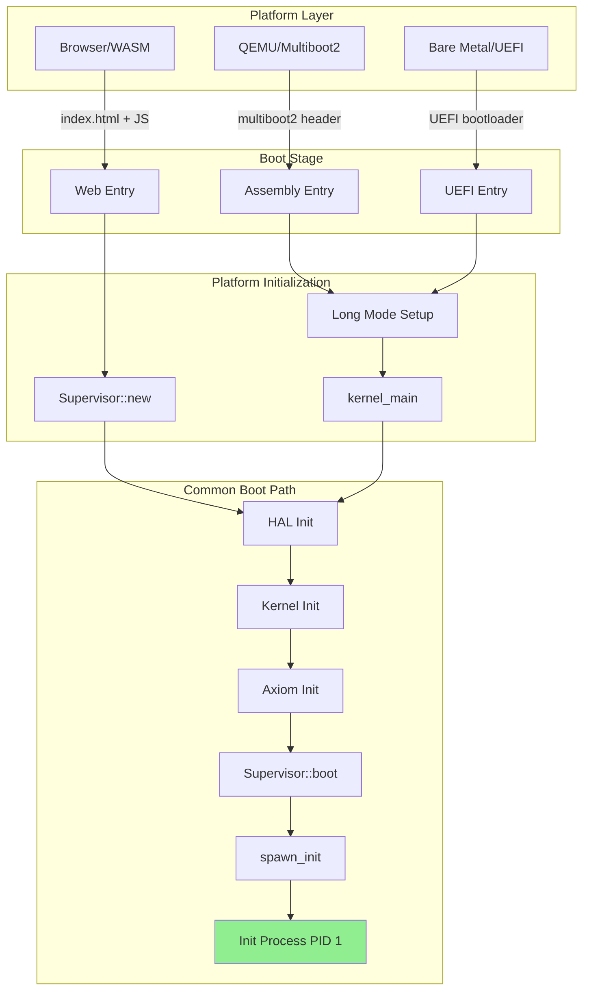
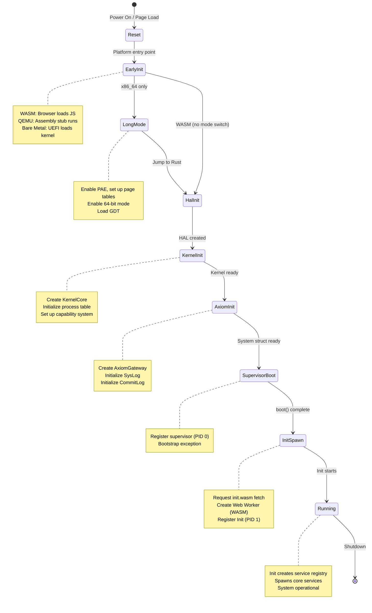

# 00 - Boot Sequence

> The boot layer handles system initialization from power-on/page-load through to Init process execution.

## Overview

Zero OS supports three target platforms with distinct boot mechanisms. Despite these differences, all platforms converge to a common kernel initialization sequence that spawns the Init process (PID 1).

### Goals

- **Platform abstraction**: Unified boot interface regardless of hardware
- **Minimal bootstrap code**: Keep pre-kernel code as small as possible
- **Auditable initialization**: All boot operations logged via Axiom
- **Deterministic startup**: Same sequence produces same initial state

### Non-Goals

- Legacy BIOS support (UEFI only for bare metal)
- Network boot (PXE/iPXE) in initial phases
- Secure Boot attestation (future phase)

## Architecture Diagram



## State Machine

The boot process follows a strict state progression:



## Interfaces

### Boot Entry Points

#### WASM Platform (Primary - Phase 1)

```typescript
// web/src/workers/worker.ts - Process entry point

interface WasmExports {
  memory?: WebAssembly.Memory;
  _start(): void;
  __zero_rt_init?(flags: number): void;
}

// Worker receives spawn message with WASM binary
self.onmessage = async (event: MessageEvent) => {
  const { binary, pid } = event.data;
  
  // Compile and instantiate WASM
  const module = await WebAssembly.compile(binary);
  const instance = await WebAssembly.instantiate(module, importObject);
  
  // Initialize runtime if exported
  if (wasmExports.__zero_rt_init) {
    wasmExports.__zero_rt_init(0);
  }
  
  // Run process - blocks forever using atomics
  wasmExports._start();
};
```

#### x86_64 Platform (QEMU/Bare Metal - Phase 2+)

```rust
// crates/zos-boot/src/main.rs

use bootloader_api::{entry_point, BootInfo, BootloaderConfig};

/// Bootloader configuration
pub static BOOTLOADER_CONFIG: BootloaderConfig = {
    let mut config = BootloaderConfig::new_default();
    config.mappings.physical_memory = Some(bootloader_api::config::Mapping::Dynamic);
    config
};

entry_point!(kernel_main, config = &BOOTLOADER_CONFIG);

/// Kernel main entry point (called by bootloader crate)
fn kernel_main(boot_info: &'static mut BootInfo) -> ! {
    // Initialize kernel heap (only allocator in zos-boot)
    unsafe { zos_boot::allocator::init(); }
    
    // Get physical memory offset from bootloader
    let phys_mem_offset = boot_info.physical_memory_offset
        .into_option()
        .expect("Physical memory offset required");
    
    // Initialize the x86_64 HAL (serial, GDT, IDT, VMM, APIC, VirtIO)
    unsafe { HAL.init(phys_mem_offset, &memory_regions); }
    
    // Stage 2.2: VMM isolation test
    // Stage 2.3: Timer interrupt test
    // Stage 2.4: Kernel integration test
    // Stage 2.6: QEMU native runtime (spawn Init via WASM runtime)
    
    // ... boot sequence continues
}
```

> **Note**: The `bootloader` crate handles Multiboot2 header, long mode transition, and page table setup. The `zos-boot` crate now only contains the kernel heap allocator. All x86_64-specific code (serial, GDT, IDT, VMM, APIC) lives in `zos-hal/src/x86_64/`.

### Supervisor Boot Interface

```rust
// crates/zos-supervisor/src/supervisor/boot.rs

#[wasm_bindgen]
impl Supervisor {
    /// Boot the kernel - initializes supervisor process (PID 0)
    #[wasm_bindgen]
    pub fn boot(&mut self) {
        self.write_console("Zero OS Kernel Bootstrap\n");
        
        // BOOTSTRAP EXCEPTION: Register supervisor as PID 0
        self.initialize_supervisor_process();
    }
    
    /// Spawn the init process (PID 1)
    /// Call after boot() and after setting spawn callback
    #[wasm_bindgen]
    pub fn spawn_init(&mut self) {
        self.request_spawn("init", "init");
    }
    
    /// Initialize VFS storage (IndexedDB)
    #[wasm_bindgen]
    pub async fn init_vfs_storage(&mut self) -> Result<JsValue, JsValue>;
    
    /// Initialize Keystore storage (separate IndexedDB)
    #[wasm_bindgen]
    pub async fn init_keystore(&mut self) -> Result<JsValue, JsValue>;
}
```

### Boot Initialization Function

```rust
// crates/zos-boot/src/lib.rs
//
// The zos-boot crate is minimal - it only contains the kernel heap allocator.
// All x86_64-specific initialization (serial, GDT, IDT, VMM, APIC) has been
// moved to zos-hal/src/x86_64/ for better separation of concerns.

pub mod allocator;

pub const VERSION: &str = env!("CARGO_PKG_VERSION");
pub const NAME: &str = "Zero OS";
```

### HAL Initialization (x86_64)

```rust
// crates/zos-hal/src/x86_64/mod.rs

impl X86_64Hal {
    /// Initialize all hardware subsystems
    ///
    /// # Safety
    /// Must be called only once during kernel initialization.
    pub unsafe fn init(&self, phys_mem_offset: u64, memory_regions: &[MemoryRegionDescriptor]) {
        serial::init();           // Serial output for debug
        gdt::init();              // GDT with TSS
        interrupts::init();       // IDT for exceptions
        vmm::init(phys_mem_offset, memory_regions);  // Virtual Memory Manager
        apic::init();             // Local APIC for timer/interrupts
        virtio::init();           // VirtIO device discovery
    }
}
```

## Platform Boot Sequences

### WASM Boot (Phase 1 - Current)

The browser handles the initial bootstrap:

```
┌─────────────────────────────────────────────────────────────────────┐
│                        WASM Boot Sequence                           │
├─────────────────────────────────────────────────────────────────────┤
│                                                                     │
│  1. Browser loads index.html                                        │
│     └─ React app initializes                                        │
│                                                                     │
│  2. React creates Supervisor instance                               │
│     └─ Loads zos_supervisor_web.wasm                                │
│     └─ Creates WasmHal                                              │
│     └─ Creates System (Axiom + KernelCore)                          │
│                                                                     │
│  3. Supervisor.boot() called                                        │
│     └─ Registers supervisor as PID 0 (bootstrap exception)          │
│     └─ Initializes Axiom logging                                    │
│                                                                     │
│  4. Supervisor.init_vfs_storage() called                            │
│     └─ Initializes zos-storage IndexedDB                            │
│     └─ Creates root filesystem if needed                            │
│                                                                     │
│  5. Supervisor.init_keystore() called                               │
│     └─ Initializes zos-keystore IndexedDB                           │
│                                                                     │
│  6. Supervisor.spawn_init() called                                  │
│     └─ Requests init.wasm from server                               │
│     └─ Creates Web Worker for init process                          │
│     └─ Sends WASM binary to worker                                  │
│                                                                     │
│  7. Init worker starts                                              │
│     └─ Instantiates init.wasm                                       │
│     └─ Reports SharedArrayBuffer to supervisor                      │
│     └─ Calls _start() - blocks on atomics                           │
│                                                                     │
│  8. Init process running                                            │
│     └─ Creates service registry                                     │
│     └─ Spawns PermissionService (PID 2)                             │
│     └─ Enters message loop                                          │
│                                                                     │
└─────────────────────────────────────────────────────────────────────┘
```

### QEMU Boot (Phase 2)

The `bootloader` crate handles Multiboot2 and long mode transition:

```
┌─────────────────────────────────────────────────────────────────────┐
│                   QEMU Boot Sequence (bootloader crate)             │
├─────────────────────────────────────────────────────────────────────┤
│                                                                     │
│  1. QEMU loads kernel ELF via -kernel flag                          │
│     └─ bootloader crate handles Multiboot2 header                   │
│     └─ Automatic long mode transition                               │
│     └─ Physical memory mapping provided via BootInfo                │
│                                                                     │
│  2. Rust kernel_main(boot_info: &'static mut BootInfo)              │
│     └─ zos_boot::allocator::init() - kernel heap                    │
│     └─ HAL.init(phys_mem_offset, memory_regions)                    │
│         ├─ serial::init() - COM1 output                             │
│         ├─ gdt::init() - GDT with TSS                               │
│         ├─ interrupts::init() - IDT                                 │
│         ├─ vmm::init() - Virtual Memory Manager                     │
│         ├─ apic::init() - Local APIC                                │
│         └─ virtio::init() - VirtIO device discovery                 │
│                                                                     │
│  3. Stage 2.2: VMM Isolation Test                                   │
│     └─ vmm::test_isolation() - verify address space separation      │
│                                                                     │
│  4. Stage 2.3: Timer Interrupt Test                                 │
│     └─ Enable hardware interrupts                                   │
│     └─ HAL.start_timer() - APIC timer (10ms interval)               │
│     └─ Verify timer ticks for 5 seconds                             │
│                                                                     │
│  5. Stage 2.4: Kernel Integration Test                              │
│     └─ Create System<X86_64Hal>                                     │
│     └─ Register test processes                                      │
│     └─ Test endpoint creation, capability grants                    │
│     └─ Test syscall processing via Axiom                            │
│     └─ Verify CommitLog records all mutations                       │
│                                                                     │
│  6. CommitLog Replay Verification                                   │
│     └─ Check VirtIO storage for persisted CommitLog snapshot        │
│     └─ If found: System::new_for_replay() + replay_and_verify()     │
│     └─ Verify state hash matches after replay                       │
│                                                                     │
│  7. Stage 2.6: QEMU Native Runtime                                  │
│     └─ Initialize WASM runtime (HAL.wasm_runtime())                 │
│     └─ Create kernel System                                         │
│     └─ Register kernel as PID 0                                     │
│     └─ Load Init via HAL.load_binary("init")                        │
│     └─ Spawn Init via HAL.spawn_process("init", binary)             │
│     └─ Enter kernel main loop:                                      │
│         ├─ Poll for syscalls from WASM processes                    │
│         ├─ Dispatch syscalls through Axiom                          │
│         ├─ Complete syscalls and resume processes                   │
│         └─ Persist CommitLog on shutdown                            │
│                                                                     │
└─────────────────────────────────────────────────────────────────────┘
```

### Bare Metal Boot (Phase 3)

UEFI boot for physical hardware:

```
┌─────────────────────────────────────────────────────────────────────┐
│                        UEFI Boot Sequence                           │
├─────────────────────────────────────────────────────────────────────┤
│                                                                     │
│  1. Firmware POST and initialization                                │
│                                                                     │
│  2. UEFI loads bootloader from ESP                                  │
│     └─ /EFI/BOOT/BOOTX64.EFI                                        │
│                                                                     │
│  3. UEFI Bootloader                                                 │
│     └─ Initialize UEFI services                                     │
│     └─ Get graphics output (GOP)                                    │
│     └─ Load kernel from ESP                                         │
│     └─ Get memory map                                               │
│     └─ Exit boot services                                           │
│     └─ Jump to kernel                                               │
│                                                                     │
│  4. Kernel entry                                                    │
│     └─ CPU already in 64-bit mode                                   │
│     └─ Process UEFI memory map                                      │
│     └─ Same as QEMU from here                                       │
│                                                                     │
└─────────────────────────────────────────────────────────────────────┘
```

## Memory Layout

### x86_64 Higher-Half Kernel

```
┌─────────────────────────────────────────────────────────────────────┐
│                        Virtual Address Space                         │
├─────────────────────────────────────────────────────────────────────┤
│                                                                     │
│  0xFFFFFFFF_FFFFFFFF ┬─────────────────────────────────────────┐   │
│                      │           (Reserved)                    │   │
│  0xFFFFFFFF_80000000 ├─────────────────────────────────────────┤   │
│                      │      Kernel Higher-Half                 │   │
│                      │  ┌─ .multiboot2 (Multiboot header)      │   │
│                      │  ├─ .text (Code)                        │   │
│                      │  ├─ .rodata (Constants, GDT)            │   │
│                      │  ├─ .data (Initialized data)            │   │
│                      │  ├─ .bss (Uninitialized, page tables)   │   │
│                      │  └─ Stack (64KB)                        │   │
│  0x00000000_00400000 ├─────────────────────────────────────────┤   │
│                      │           (Identity mapped)             │   │
│                      │      First 4MB for boot                 │   │
│  0x00000000_00100000 ├─────────────────────────────────────────┤   │
│                      │      Kernel load address (1MB)          │   │
│  0x00000000_00000000 └─────────────────────────────────────────┘   │
│                                                                     │
└─────────────────────────────────────────────────────────────────────┘
```

**Linker Script Configuration:**

```
KERNEL_VMA = 0xFFFFFFFF80000000  // Virtual address (higher half)
KERNEL_LMA = 0x100000            // Physical load address (1MB)
```

### WASM Memory Layout

```
┌─────────────────────────────────────────────────────────────────────┐
│                    WASM Linear Memory (per process)                 │
├─────────────────────────────────────────────────────────────────────┤
│                                                                     │
│  Offset 0x0000 ┬─────────────────────────────────────────────────┐ │
│                │  Syscall Mailbox (16KB)                         │ │
│                │  ├─ 0x00: status (idle/pending/ready)           │ │
│                │  ├─ 0x04: syscall_num                           │ │
│                │  ├─ 0x08: arg0, arg1, arg2                      │ │
│                │  ├─ 0x14: result                                │ │
│                │  ├─ 0x18: data_len                              │ │
│                │  ├─ 0x1C: data buffer (16356 bytes)             │ │
│                │  └─ 0x38: pid                                   │ │
│  Offset 0x4000 ├─────────────────────────────────────────────────┤ │
│                │  WASM Data Sections                             │ │
│                │  ├─ .data (initialized)                         │ │
│                │  └─ .bss (uninitialized)                        │ │
│                ├─────────────────────────────────────────────────┤ │
│                │  Heap (grows up)                                │ │
│                ├─────────────────────────────────────────────────┤ │
│                │  Stack (grows down)                             │ │
│  End of memory └─────────────────────────────────────────────────┘ │
│                                                                     │
└─────────────────────────────────────────────────────────────────────┘
```

## Multiboot2 Header

The kernel includes a Multiboot2 header for QEMU compatibility:

```asm
; crates/zos-boot/src/boot.s

.set MULTIBOOT2_MAGIC,    0xE85250D6
.set MULTIBOOT2_ARCH,     0           /* i386 protected mode */
.set MULTIBOOT2_LENGTH,   (multiboot2_header_end - multiboot2_header_start)
.set MULTIBOOT2_CHECKSUM, -(MULTIBOOT2_MAGIC + MULTIBOOT2_ARCH + MULTIBOOT2_LENGTH)

.section .multiboot2, "a"
.align 8
multiboot2_header_start:
    .long MULTIBOOT2_MAGIC
    .long MULTIBOOT2_ARCH
    .long MULTIBOOT2_LENGTH
    .long MULTIBOOT2_CHECKSUM
    
    /* End tag */
    .align 8
    .short 0    /* type */
    .short 0    /* flags */
    .long 8     /* size */
multiboot2_header_end:
```

## Bootstrap Exception

The supervisor makes **two direct kernel calls** during bootstrap, documented as a necessary exception to the Init-driven spawn protocol:

### Why This Exception Exists

1. **The Bootstrap Problem**: Init (PID 1) handles all process spawns via IPC, but Init cannot spawn itself.

2. **Supervisor Registration (PID 0)**: The supervisor must exist in the process table to hold capabilities for IPC communication.

3. **Init Creation (PID 1)**: Init must be created before it can handle spawn requests.

### Exception Boundaries

| Operation | Method | Acceptable? |
|-----------|--------|-------------|
| Register supervisor (PID 0) | Direct kernel call | ✓ Bootstrap |
| Create init (PID 1) | Direct kernel call | ✓ Bootstrap |
| Any other process | Via Init IPC | Required |

### Compliance with Invariants

- **Invariant 9 (SysLog)**: Direct kernel calls still log commits to Axiom
- **Invariant 16 (Supervisor privilege)**: After bootstrap, supervisor uses capability-checked IPC
- **One-time operation**: Happens once at system start
- **Trusted component**: Supervisor is a system component, not untrusted userspace

## Invariants

The boot sequence must uphold these invariants:

| # | Invariant | Enforcement |
|---|-----------|-------------|
| 1 | All authority flows through Axiom | Boot operations logged via Axiom commit logging |
| 9 | Axiom is the single syscall gateway | Even bootstrap direct calls go through System struct |
| 13 | Supervisor is a thin transport boundary | After bootstrap, uses IPC only |
| 16 | Supervisor cannot bypass Axiom | Direct calls during bootstrap are logged |
| 28 | All storage access through HAL | `init_vfs_storage()` uses HAL async pattern |
| 30 | Bootstrap storage exception | Supervisor may use async vfs module during bootstrap |

### Well-Known PIDs

| PID | Process | Created During |
|-----|---------|----------------|
| 0 | Supervisor | `boot()` |
| 1 | Init | `spawn_init()` |
| 2 | PermissionService | Init startup |

### Well-Known Endpoint IDs

| Endpoint ID | Purpose |
|-------------|---------|
| 1 | Init's message endpoint |

## CommitLog Persistence and Replay

On QEMU, the CommitLog is persisted to VirtIO block storage on shutdown and replayed on boot to verify state integrity.

### Persistence on Shutdown

```rust
// crates/zos-boot/src/main.rs

/// Persist CommitLog snapshot to storage
fn persist_commitlog(system: &System<X86_64Hal>, hal: &X86_64Hal) {
    let snapshot = CommitLogSnapshot {
        commits: system.commitlog().commits().to_vec(),
        state_hash: system.state_hash(),
    };
    hal.bootstrap_storage_put_inode(COMMITLOG_KEY, &serde_json::to_vec(&snapshot)?)?;
}
```

### Replay Verification on Boot

```rust
// crates/zos-boot/src/main.rs

// Check for persisted CommitLog
match hal.bootstrap_storage_get_inode(COMMITLOG_KEY) {
    Ok(Some(data)) => {
        let snapshot: CommitLogSnapshot = serde_json::from_slice(&data)?;
        
        // Create replay system and verify
        let mut replay_system: System<X86_64Hal> = System::new_for_replay();
        replay_and_verify(&mut replay_system, &snapshot.commits, snapshot.state_hash)?;
        
        serial_println!("[replay] CommitLog replay verified");
    }
    Ok(None) => {
        serial_println!("[replay] No CommitLog snapshot found (fresh boot)");
    }
    Err(e) => { /* handle error */ }
}
```

### Replay Invariant

```
Replayed State = reduce(genesis, persisted_commits) = state_hash
```

If the replayed state's hash doesn't match the persisted hash, the boot fails with a verification error, indicating data corruption or tampering.

## Platform Notes

### WASM (Phase 1)

- No assembly required - browser provides execution environment
- Web Workers provide process isolation via WASM sandbox
- SharedArrayBuffer required for atomics-based syscalls
- IndexedDB provides persistent storage (two databases)
- Cooperative scheduling (no preemption)

### QEMU (Phase 2)

- Uses `bootloader` crate (Multiboot2 + automatic long mode)
- Serial port (COM1) for debug output
- VirtIO for block storage (CommitLog persistence)
- APIC timer for preemptive scheduling
- Embedded WASM binaries via `include_bytes!()` in HAL
- WASM runtime (`wasmi`) for executing service processes

### Bare Metal (Phase 3)

- UEFI-only (no legacy BIOS)
- GOP for framebuffer
- ACPI for hardware enumeration
- Hardware MMU for memory protection
- Full hardware interrupt support

## Implementation References

| Component | Source File | Description |
|-----------|-------------|-------------|
| WASM Worker | `web/src/workers/worker.ts` | Process WASM instantiation |
| Supervisor Boot | `crates/zos-supervisor/src/supervisor/boot.rs` | `boot()`, `spawn_init()` |
| Kernel Main | `crates/zos-boot/src/main.rs` | `entry_point!` macro and boot stages |
| Boot Library | `crates/zos-boot/src/lib.rs` | Version constants (allocator only) |
| Heap Allocator | `crates/zos-boot/src/allocator.rs` | Kernel heap |
| x86_64 HAL | `crates/zos-hal/src/x86_64/mod.rs` | HAL init, all x86_64 subsystems |
| Serial Driver | `crates/zos-hal/src/x86_64/serial.rs` | COM1 output |
| GDT Setup | `crates/zos-hal/src/x86_64/gdt.rs` | GDT with TSS |
| IDT Setup | `crates/zos-hal/src/x86_64/interrupts.rs` | Exception handlers |
| VMM | `crates/zos-hal/src/x86_64/vmm/` | Virtual Memory Manager |
| APIC | `crates/zos-hal/src/x86_64/apic.rs` | Timer and interrupt handling |
| VirtIO | `crates/zos-hal/src/x86_64/virtio/` | VirtIO device drivers |
| WASM Runtime | `crates/zos-hal/src/x86_64/wasm/` | WASM process execution |
| CommitLog Replay | `crates/zos-kernel/src/lib.rs` | `replay_and_verify()` function |

## Related Specs

- [01-hal.md](01-hal.md) - Hardware Abstraction Layer initialized during boot
- [02-kernel.md](02-kernel.md) - Kernel created during boot sequence
- [03-axiom.md](03-axiom.md) - Axiom gateway initialized for logging
- [04-init-supervisor.md](04-init-supervisor.md) - Init process spawned at end of boot
