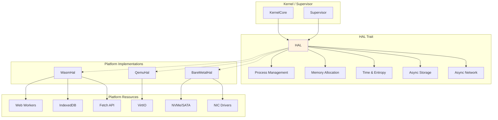
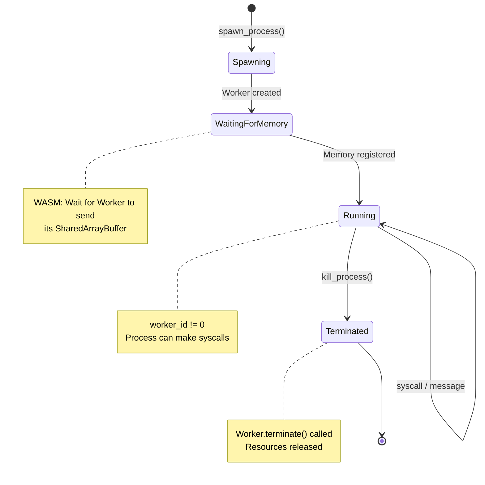
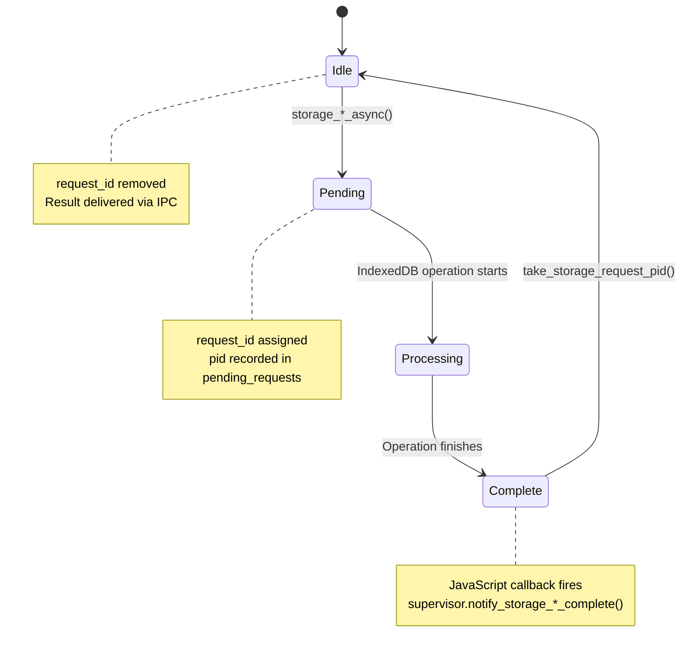
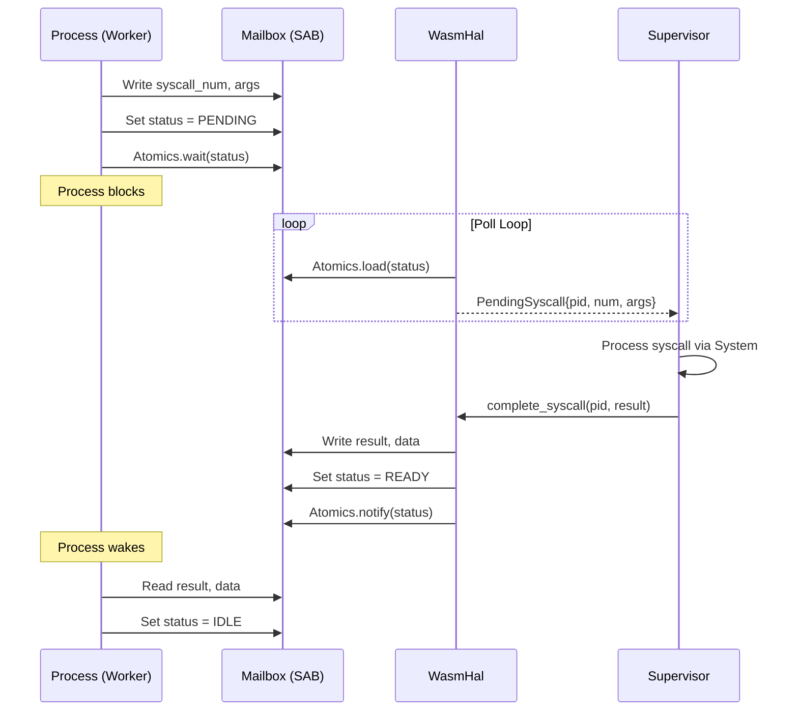

# 01 - Hardware Abstraction Layer

> The HAL enables Zero OS to run on multiple platforms with a single codebase.

## Overview

The Hardware Abstraction Layer (HAL) defines a trait that abstracts platform-specific operations. This allows the kernel and supervisor to be written once and run on WASM, QEMU, and bare metal without modification.

### Goals

- **Single codebase**: Identical kernel logic across all platforms
- **Platform capability discovery**: Query what features are available
- **Clean process abstraction**: Unified process lifecycle regardless of isolation mechanism
- **Async I/O pattern**: Non-blocking storage and network operations

### Non-Goals

- Direct hardware access (that's the driver layer)
- Platform-specific optimizations (initial phases)
- Legacy hardware support

## Architecture Diagram



## Interfaces

### Core HAL Trait

```rust
/// Hardware Abstraction Layer trait
///
/// Implementations provide platform-specific functionality for:
/// - Process management (spawn, kill, message passing)
/// - Memory allocation
/// - Time measurement
/// - Entropy (random numbers)
/// - Debug output
pub trait HAL: Send + Sync + 'static {
    /// Handle to a spawned process
    /// - On WASM: Reference to a Web Worker
    /// - On QEMU/bare metal: Process ID or memory region reference
    type ProcessHandle: Clone + Send + Sync;

    // === Process Management ===
    
    fn spawn_process(&self, name: &str, binary: &[u8]) -> Result<Self::ProcessHandle, HalError>;
    fn kill_process(&self, handle: &Self::ProcessHandle) -> Result<(), HalError>;
    fn send_to_process(&self, handle: &Self::ProcessHandle, msg: &[u8]) -> Result<(), HalError>;
    fn is_process_alive(&self, handle: &Self::ProcessHandle) -> bool;
    fn get_process_memory_size(&self, handle: &Self::ProcessHandle) -> Result<usize, HalError>;

    // === Memory ===
    
    fn allocate(&self, size: usize, align: usize) -> Result<*mut u8, HalError>;
    unsafe fn deallocate(&self, ptr: *mut u8, size: usize, align: usize);

    // === Time & Entropy ===
    
    fn now_nanos(&self) -> u64;
    fn wallclock_ms(&self) -> u64;
    fn random_bytes(&self, buf: &mut [u8]) -> Result<(), HalError>;

    // === Debug ===
    
    fn debug_write(&self, msg: &str);

    // === Message Reception ===
    
    fn poll_messages(&self) -> Vec<(Self::ProcessHandle, Vec<u8>)>;
    fn set_message_callback(&self, callback: Option<MessageCallback<Self::ProcessHandle>>);

    // === Async Storage (VFS Only) ===
    
    fn storage_read_async(&self, pid: u64, key: &str) -> Result<StorageRequestId, HalError>;
    fn storage_write_async(&self, pid: u64, key: &str, value: &[u8]) -> Result<StorageRequestId, HalError>;
    fn storage_delete_async(&self, pid: u64, key: &str) -> Result<StorageRequestId, HalError>;
    fn storage_list_async(&self, pid: u64, prefix: &str) -> Result<StorageRequestId, HalError>;
    fn storage_exists_async(&self, pid: u64, key: &str) -> Result<StorageRequestId, HalError>;
    fn get_storage_request_pid(&self, request_id: StorageRequestId) -> Option<u64>;
    fn take_storage_request_pid(&self, request_id: StorageRequestId) -> Option<u64>;

    // === Async Keystore (KeystoreService Only) ===
    
    fn keystore_read_async(&self, pid: u64, key: &str) -> Result<StorageRequestId, HalError>;
    fn keystore_write_async(&self, pid: u64, key: &str, value: &[u8]) -> Result<StorageRequestId, HalError>;
    fn keystore_delete_async(&self, pid: u64, key: &str) -> Result<StorageRequestId, HalError>;
    fn keystore_list_async(&self, pid: u64, prefix: &str) -> Result<StorageRequestId, HalError>;
    fn keystore_exists_async(&self, pid: u64, key: &str) -> Result<StorageRequestId, HalError>;
    fn get_keystore_request_pid(&self, request_id: StorageRequestId) -> Option<u64>;
    fn take_keystore_request_pid(&self, request_id: StorageRequestId) -> Option<u64>;

    // === Async Network ===
    
    fn network_fetch_async(&self, pid: u64, request: &[u8]) -> Result<NetworkRequestId, HalError>;
    fn get_network_request_pid(&self, request_id: NetworkRequestId) -> Option<u64>;
    fn take_network_request_pid(&self, request_id: NetworkRequestId) -> Option<u64>;

    // === Bootstrap Storage (Supervisor Only) ===
    
    fn bootstrap_storage_init(&self) -> Result<bool, HalError>;
    fn bootstrap_storage_get_inode(&self, path: &str) -> Result<Option<Vec<u8>>, HalError>;
    fn bootstrap_storage_put_inode(&self, path: &str, inode_json: &[u8]) -> Result<(), HalError>;
    fn bootstrap_storage_inode_count(&self) -> Result<u64, HalError>;
    fn bootstrap_storage_clear(&self) -> Result<(), HalError>;

    // === Binary Loading (QEMU Native Runtime) ===
    
    /// Load a WASM binary by name (QEMU: embedded, WASM: returns NotSupported)
    fn load_binary(&self, name: &str) -> Result<&'static [u8], HalError>;
}
```

### HAL Errors

```rust
#[derive(Clone, Copy, Debug, PartialEq, Eq)]
pub enum HalError {
    OutOfMemory,
    ProcessSpawnFailed,
    ProcessNotFound,
    InvalidMessage,
    NotSupported,
    IoError,
    InvalidArgument,
    StorageError,
    ResourceExhausted,
    NotFound,        // Binary not found (load_binary)
    InvalidBinary,   // Invalid WASM binary format
}
```

### Process Message Types

```rust
#[repr(u8)]
pub enum ProcessMessageType {
    Init = 0,           // Initialize process with PID and capabilities
    Syscall = 1,        // Syscall from process to supervisor
    SyscallResult = 2,  // Syscall result from supervisor to process
    IpcDeliver = 3,     // IPC message delivery
    Terminate = 4,      // Process termination request
    Ready = 5,          // Process ready notification
    Error = 6,          // Error notification
}
```

### Request ID Types

```rust
/// Request ID for tracking async storage operations
pub type StorageRequestId = u32;

/// Request ID for tracking async network operations
pub type NetworkRequestId = u32;
```

## State Machine

### Process Lifecycle



### Async Storage Operation



## WASM HAL Implementation

### Architecture

```
┌─────────────────────────────────────────────────────────────────────────────┐
│                              WasmHal                                         │
├─────────────────────────────────────────────────────────────────────────────┤
│                                                                             │
│  ┌───────────────────────────────────────────────────────────────────────┐ │
│  │                         Process Management                             │ │
│  │   • Web Workers for isolation                                         │ │
│  │   • SharedArrayBuffer for syscall mailbox                             │ │
│  │   • Atomics.wait/notify for synchronization                           │ │
│  └───────────────────────────────────────────────────────────────────────┘ │
│                                                                             │
│  ┌───────────────────────────────────────────────────────────────────────┐ │
│  │                         Storage (IndexedDB)                            │ │
│  │   • zos-storage: General filesystem data                              │ │
│  │   • zos-keystore: Cryptographic key material (isolated)               │ │
│  └───────────────────────────────────────────────────────────────────────┘ │
│                                                                             │
│  ┌───────────────────────────────────────────────────────────────────────┐ │
│  │                         Network (Fetch API)                            │ │
│  │   • HTTP requests via window.fetch()                                  │ │
│  │   • Async with request_id tracking                                    │ │
│  └───────────────────────────────────────────────────────────────────────┘ │
│                                                                             │
│  ┌───────────────────────────────────────────────────────────────────────┐ │
│  │                         Time & Entropy                                 │ │
│  │   • performance.now() for monotonic time                              │ │
│  │   • Date.now() for wall clock                                         │ │
│  │   • crypto.getRandomValues() for entropy                              │ │
│  └───────────────────────────────────────────────────────────────────────┘ │
│                                                                             │
└─────────────────────────────────────────────────────────────────────────────┘
```

### Syscall Mailbox Layout

Each process has a 16KB SharedArrayBuffer for syscall communication:

```
┌─────────────────────────────────────────────────────────────────────────────┐
│                    Syscall Mailbox (16KB SharedArrayBuffer)                  │
├─────────────────────────────────────────────────────────────────────────────┤
│                                                                             │
│  Offset 0x00 (i32): status                                                 │
│    • 0 = IDLE (no pending syscall)                                         │
│    • 1 = PENDING (process waiting for response)                            │
│    • 2 = READY (supervisor wrote result)                                   │
│                                                                             │
│  Offset 0x04 (i32): syscall_num                                            │
│  Offset 0x08 (i32): arg0                                                   │
│  Offset 0x0C (i32): arg1                                                   │
│  Offset 0x10 (i32): arg2                                                   │
│  Offset 0x14 (i32): result                                                 │
│  Offset 0x18 (i32): data_len                                               │
│  Offset 0x1C (16356 bytes): data buffer                                    │
│                                                                             │
└─────────────────────────────────────────────────────────────────────────────┘
```

### Syscall Flow



### Resource Limits

To prevent unbounded memory growth from pending async operations:

| Resource | Limit | Error on Exceed |
|----------|-------|-----------------|
| Pending storage requests | 1000 | `HalError::ResourceExhausted` |
| Pending keystore requests | 1000 | `HalError::ResourceExhausted` |
| Pending network requests | 100 | `HalError::ResourceExhausted` |

## Platform Capabilities

| Capability | WASM | QEMU | Bare Metal |
|------------|------|------|------------|
| **Process Isolation** | Web Workers + WASM sandbox | WASM sandbox (wasmi) | Hardware MMU |
| **Preemption** | Cooperative (no interrupts) | APIC timer interrupt | Timer interrupt |
| **Memory Protection** | WASM linear memory | WASM + Page tables | Page tables |
| **Storage** | IndexedDB (2 databases) | VirtIO-blk | NVMe/SATA |
| **Network** | Fetch/WebSocket | VirtIO-net | NIC drivers |
| **Random** | crypto.getRandomValues() | RDRAND/TSC-PRNG | RDRAND/TPM |
| **Time (monotonic)** | performance.now() | APIC elapsed time | TSC/HPET |
| **Time (wall clock)** | Date.now() | CMOS RTC | CMOS RTC |
| **Debug Output** | console.log() | Serial (COM1) | Serial/VGA |
| **Binary Loading** | Network fetch (async) | Embedded (include_bytes!) | Disk/EFI |
| **Service Spawning** | Supervisor async flow | Direct syscall | Direct syscall |

## Invariants

| # | Invariant | Enforcement |
|---|-----------|-------------|
| 28 | All storage access through HAL | Storage syscalls route to `storage_*_async()` methods |
| 29 | Dual storage objects | `zos-storage` and `zos-keystore` are separate IndexedDB databases |
| 30 | Bootstrap storage exception | `bootstrap_storage_*` methods available only during supervisor init |

### Async Pattern Invariant

All storage and network operations are **non-blocking**:

1. Request starts → returns `request_id` immediately
2. HAL tracks `pending_requests[request_id] = pid`
3. Platform completes operation asynchronously
4. Callback delivers result via IPC to requesting process
5. `take_*_request_pid()` removes tracking entry

**Critical**: Callbacks do NOT go back through Axiom/Kernel—they're delivered as standard IPC messages.

## Platform Notes

### WASM (Phase 1 - Current)

- **SharedArrayBuffer requirement**: Processes must import shared memory for atomics to work. Build with `rustflags = ["-C", "link-args=--import-memory"]`
- **worker_id tracking**: HAL waits for Worker to send its SharedArrayBuffer via postMessage before polling. `worker_id == 0` means the buffer isn't registered yet.
- **Memory growth**: When WASM memory grows, Worker sends a new SharedArrayBuffer. HAL updates its reference.
- **Two IndexedDB databases**: 
  - `zos-storage`: General filesystem (VFS access)
  - `zos-keystore`: Cryptographic keys (KeystoreService access)

### QEMU (Phase 2)

- **VirtIO**: Block and network devices via virtio protocol
- **Hardware preemption**: Timer interrupts enable true preemptive scheduling
- **Page tables**: Hardware-enforced memory isolation between processes
- **WASM runtime**: Embedded `wasmi` interpreter for service processes
- **Embedded binaries**: `include_bytes!()` for WASM service binaries

## X86_64Hal Implementation

The `X86_64Hal` provides the full HAL implementation for QEMU and bare metal targets.

### Architecture

```
┌─────────────────────────────────────────────────────────────────────────────┐
│                              X86_64Hal                                       │
├─────────────────────────────────────────────────────────────────────────────┤
│                                                                             │
│  ┌───────────────────────────────────────────────────────────────────────┐ │
│  │                       Hardware Abstraction                             │ │
│  │   • serial::init() - COM1 debug output                                │ │
│  │   • gdt::init() - GDT with TSS for interrupt handling                 │ │
│  │   • interrupts::init() - IDT for exceptions                           │ │
│  │   • vmm::init() - Virtual Memory Manager (4-level page tables)        │ │
│  │   • apic::init() - Local APIC for timer/interrupts                    │ │
│  │   • virtio::init() - VirtIO device discovery (block, network)         │ │
│  └───────────────────────────────────────────────────────────────────────┘ │
│                                                                             │
│  ┌───────────────────────────────────────────────────────────────────────┐ │
│  │                       WASM Runtime                                     │ │
│  │   • wasm_runtime() - wasmi-based WASM interpreter                     │ │
│  │   • spawn_process() - instantiate WASM module                         │ │
│  │   • run_scheduler() - cooperative execution, returns pending syscalls │ │
│  │   • complete_syscall() - resume process with syscall result           │ │
│  └───────────────────────────────────────────────────────────────────────┘ │
│                                                                             │
│  ┌───────────────────────────────────────────────────────────────────────┐ │
│  │                       Embedded Binaries                                │ │
│  │   • load_binary("init") → init.wasm                                   │ │
│  │   • load_binary("permission") → permission.wasm                       │ │
│  │   • load_binary("vfs") → vfs.wasm                                     │ │
│  │   • load_binary("keystore") → keystore.wasm                           │ │
│  │   • load_binary("identity") → identity.wasm                           │ │
│  │   • load_binary("time") → time.wasm                                   │ │
│  │   • load_binary("terminal") → terminal.wasm                           │ │
│  │   • load_binary("settings") → settings.wasm                           │ │
│  │   • load_binary("calculator") → calculator.wasm                       │ │
│  │   • load_binary("clock") → clock.wasm                                 │ │
│  └───────────────────────────────────────────────────────────────────────┘ │
│                                                                             │
│  ┌───────────────────────────────────────────────────────────────────────┐ │
│  │                       Storage (VirtIO Block)                           │ │
│  │   • bootstrap_storage_init() - initialize block device                │ │
│  │   • bootstrap_storage_get_inode() - read key-value                    │ │
│  │   • bootstrap_storage_put_inode() - write key-value                   │ │
│  │   • storage_*_async() - VFS storage operations                        │ │
│  └───────────────────────────────────────────────────────────────────────┘ │
│                                                                             │
│  ┌───────────────────────────────────────────────────────────────────────┐ │
│  │                       Time & Entropy                                   │ │
│  │   • now_nanos() - APIC elapsed time or TSC fallback                   │ │
│  │   • wallclock_ms() - CMOS RTC for wall-clock time                     │ │
│  │   • random_bytes() - RDRAND instruction or TSC-seeded PRNG            │ │
│  └───────────────────────────────────────────────────────────────────────┘ │
│                                                                             │
└─────────────────────────────────────────────────────────────────────────────┘
```

### Binary Loading

```rust
// crates/zos-hal/src/x86_64/mod.rs

mod embedded_binaries {
    pub static INIT: &[u8] = include_bytes!("../../../../web/processes/init.wasm");
    pub static PERMISSION: &[u8] = include_bytes!("../../../../web/processes/permission.wasm");
    pub static VFS: &[u8] = include_bytes!("../../../../web/processes/vfs.wasm");
    // ... other services
}

impl HAL for X86_64Hal {
    fn load_binary(&self, name: &str) -> Result<&'static [u8], HalError> {
        match name {
            "init" => Ok(embedded_binaries::INIT),
            "permission" => Ok(embedded_binaries::PERMISSION),
            "vfs" => Ok(embedded_binaries::VFS),
            // ... other services
            _ => Err(HalError::NotFound),
        }
    }
}
```

### Scheduler Integration

```rust
// crates/zos-hal/src/x86_64/mod.rs

impl X86_64Hal {
    /// Run the process scheduler
    ///
    /// Executes WASM processes cooperatively. Returns pending syscalls
    /// from processes for the supervisor to handle.
    pub fn run_scheduler(&self) -> Vec<PendingSyscall> {
        self.wasm_runtime().take_pending_syscalls()
    }
    
    /// Complete a syscall and resume the process
    pub fn complete_syscall(&self, pid: u64, result: u32, data: &[u8]) {
        self.wasm_runtime().complete_syscall(pid, result, data);
    }
}

/// A pending syscall from a WASM process
pub struct PendingSyscall {
    pub pid: u64,
    pub syscall_num: u32,
    pub args: [u32; 3],
    pub data: Vec<u8>,
}
```

### Bare Metal (Phase 3)

- **UEFI boot**: Firmware provides initial environment
- **Hardware MMU**: Full memory protection
- **Native drivers**: NVMe, SATA, NIC drivers in userspace

## Implementation References

| Component | Source File | Description |
|-----------|-------------|-------------|
| HAL trait | `crates/zos-hal/src/lib.rs` | Core trait definition |
| WasmHal | `crates/zos-supervisor/src/hal/mod.rs` | Browser WASM implementation |
| Process mgmt | `crates/zos-supervisor/src/hal/process.rs` | Web Worker lifecycle |
| Storage ops | `crates/zos-supervisor/src/hal/storage.rs` | IndexedDB integration |
| Network ops | `crates/zos-supervisor/src/hal/network.rs` | Fetch API integration |
| X86_64Hal | `crates/zos-hal/src/x86_64/mod.rs` | QEMU/bare metal HAL |
| x86_64 Serial | `crates/zos-hal/src/x86_64/serial.rs` | COM1 debug output |
| x86_64 GDT | `crates/zos-hal/src/x86_64/gdt.rs` | GDT with TSS |
| x86_64 IDT | `crates/zos-hal/src/x86_64/interrupts.rs` | Exception handlers |
| x86_64 VMM | `crates/zos-hal/src/x86_64/vmm/` | Virtual Memory Manager |
| x86_64 APIC | `crates/zos-hal/src/x86_64/apic.rs` | Timer and interrupts |
| x86_64 VirtIO | `crates/zos-hal/src/x86_64/virtio/` | VirtIO drivers |
| x86_64 WASM | `crates/zos-hal/src/x86_64/wasm/` | wasmi runtime |
| x86_64 RTC | `crates/zos-hal/src/x86_64/rtc.rs` | CMOS RTC wall clock |
| x86_64 Storage | `crates/zos-hal/src/x86_64/storage.rs` | VirtIO block storage |
| TestHal | `crates/zos-hal/src/lib.rs` | Unit test stub |

## Related Specs

- [00-boot.md](00-boot.md) - HAL initialized during boot sequence
- [02-kernel.md](02-kernel.md) - Kernel uses HAL for process operations
- [06-services.md](06-services.md) - VFS and Keystore use HAL storage methods
