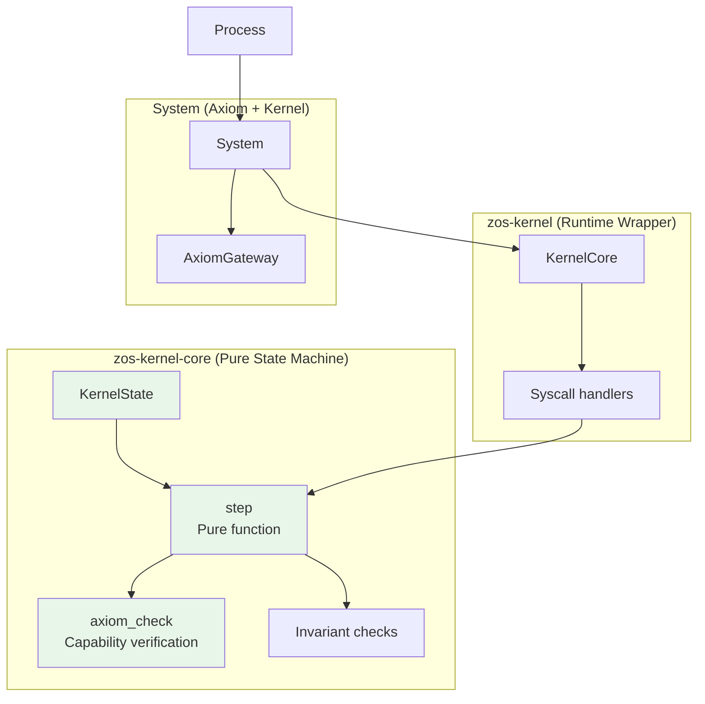
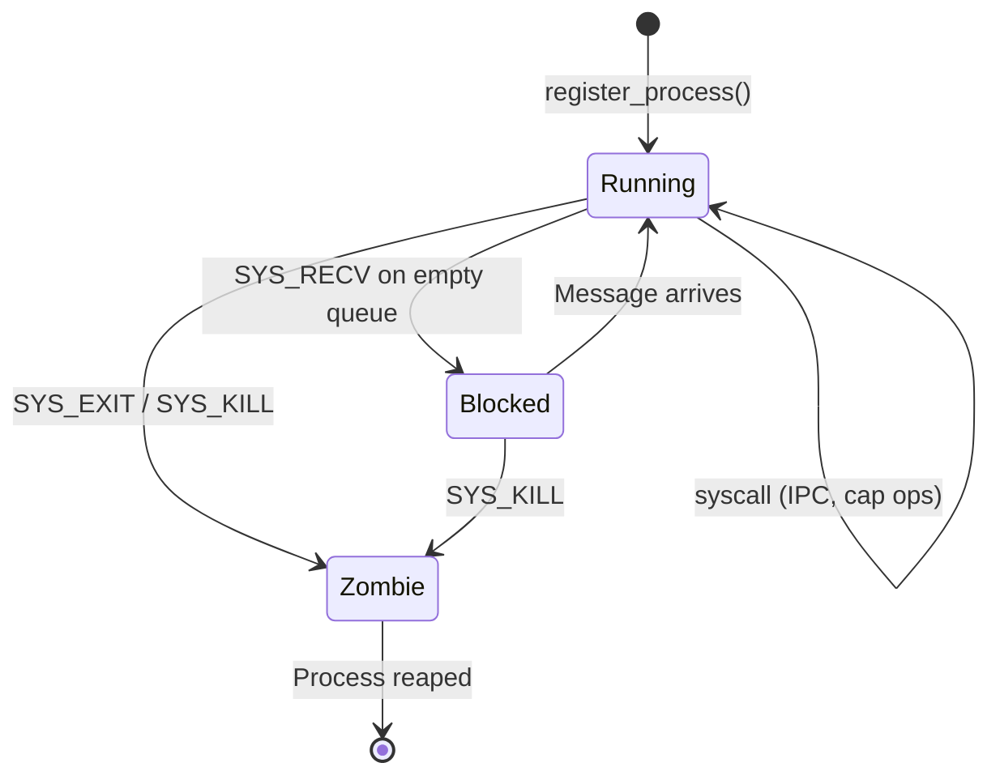
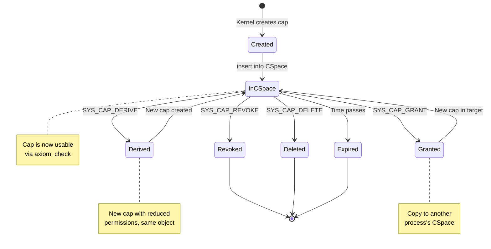
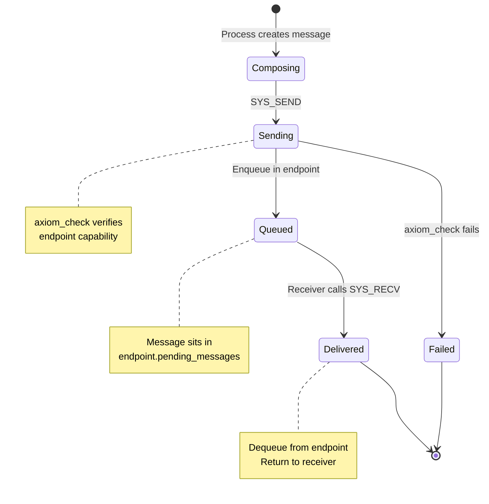

# 02 - Microkernel

> The kernel implements only mechanism—IPC, scheduling, capabilities, and commit emission. All policy lives in userspace.

## Overview

Zero OS uses a minimal microkernel architecture with a strict 3,000 LOC budget. The kernel is split into two crates:

- **`zos-kernel-core`**: Pure state machine with no I/O, no HAL—the primary verification target
- **`zos-kernel`**: Runtime wrapper integrating kernel-core with HAL and Axiom

### Goals

- **Auditability**: Small enough for one person to understand completely
- **Verifiability**: Pure functional core suitable for Kani/TLA+ proofs
- **Determinism**: Same input always produces same output
- **Minimal TCB**: Only IPC, scheduling, capabilities, memory, commit emission

### Non-Goals

- Filesystems (userspace VFS service)
- Network stacks (userspace Network service)
- Drivers (userspace driver model)
- Security policy (userspace PermissionService)

## Architecture Diagram



## Interfaces

### KernelState (Pure State)

```rust
/// Complete kernel state - all data needed for deterministic execution
pub struct KernelState {
    /// Process table
    pub processes: BTreeMap<ProcessId, Process>,
    /// Capability spaces (one per process)
    pub cap_spaces: BTreeMap<ProcessId, CapabilitySpace>,
    /// IPC endpoints
    pub endpoints: BTreeMap<EndpointId, Endpoint>,
    /// Next IDs to allocate
    pub next_pid: u64,
    pub next_endpoint_id: u64,
    pub next_cap_id: u64,
    /// Global metrics
    pub total_ipc_count: u64,
}
```

### Process Descriptor

```rust
/// Process descriptor
pub struct Process {
    pub pid: ProcessId,
    pub name: String,
    pub state: ProcessState,
    pub metrics: ProcessMetrics,
}

#[derive(Clone, Copy, Debug, PartialEq, Eq)]
pub enum ProcessState {
    Running,
    Blocked,
    Zombie,
}

pub struct ProcessMetrics {
    pub memory_size: usize,
    pub ipc_sent: u64,
    pub ipc_received: u64,
    pub ipc_bytes_sent: u64,
    pub ipc_bytes_received: u64,
    pub syscall_count: u64,
    pub last_active_ns: u64,
    pub start_time_ns: u64,
}
```

### Capability System

```rust
/// A capability token - proof of authority to access a resource
pub struct Capability {
    pub id: u64,
    pub object_type: ObjectType,
    pub object_id: u64,
    pub permissions: Permissions,
    pub generation: u32,
    pub expires_at: u64,  // 0 = never expires
}

#[derive(Clone, Copy, Debug, Default)]
pub struct Permissions {
    pub read: bool,
    pub write: bool,
    pub grant: bool,
}

#[repr(u8)]
pub enum ObjectType {
    Endpoint = 1,
    Process = 2,
    Memory = 3,
    Irq = 4,
    IoPort = 5,
    Console = 6,
}

/// Per-process capability table
pub struct CapabilitySpace {
    pub slots: BTreeMap<CapSlot, Capability>,
    pub next_slot: CapSlot,
}
```

### IPC Endpoint

```rust
pub struct Endpoint {
    pub id: EndpointId,
    pub owner: ProcessId,
    pub pending_messages: VecDeque<Message>,
    pub metrics: EndpointMetrics,
}

pub struct Message {
    pub sender: ProcessId,
    pub tag: u32,
    pub data: Vec<u8>,
    pub caps: Vec<TransferredCap>,
}

pub const MAX_MESSAGE_SIZE: usize = 4096;
pub const MAX_CAPS_PER_MESSAGE: usize = 4;
```

### The Pure Step Function

```rust
/// Execute a syscall on kernel state (THE verification target)
///
/// Properties:
/// 1. Deterministic: Same state + syscall → same result
/// 2. No side effects: Only mutates provided state
/// 3. Authority checked: All cap operations go through axiom_check
pub fn step(
    state: &mut KernelState,
    from_pid: ProcessId,
    syscall: Syscall,
    timestamp: u64,
) -> StepResult;

pub struct StepResult {
    pub result: SyscallResult,
    pub commits: Vec<Commit>,
}
```

### axiom_check Function

```rust
/// Check if a process has authority to perform an operation.
///
/// This is THE Axiom gatekeeper function. Every syscall that requires
/// authority calls this before executing.
///
/// # Security Properties (Verification Targets)
/// 1. No Forged Object: Only IDs we inserted can be returned
/// 2. No Rights Escalation: Returned cap.permissions >= required
/// 3. Fail Closed: Invalid/malformed handles always error
pub fn axiom_check<'a>(
    cspace: &'a CapabilitySpace,
    slot: CapSlot,
    required: &Permissions,
    expected_type: Option<ObjectType>,
    current_time: u64,
) -> Result<&'a Capability, AxiomError>;

pub enum AxiomError {
    InvalidSlot,
    WrongType,
    InsufficientRights,
    Expired,
    ObjectNotFound,
}
```

## State Machine

### Process Lifecycle



### Capability Lifecycle



### IPC Message Flow



## Syscall ABI

### Syscall Number Ranges

| Range | Category | Description |
|-------|----------|-------------|
| 0x01-0x0F | Misc | Debug, time, yield, exit |
| 0x10-0x1F | Process | Create endpoint, kill, register, load binary, spawn |
| 0x30-0x3F | Capability | Grant, revoke, delete, inspect, derive |
| 0x40-0x4F | IPC | Send, receive, call, reply |
| 0x50-0x5F | System | List processes |
| 0x70-0x7F | Storage | Async platform storage (VFS only) |
| 0x80-0x8F | Keystore | Async key storage (KeystoreService only) |
| 0x90-0x9F | Network | Async HTTP (NetworkService only) |

### Core Syscalls

| Syscall | Number | Arguments | Returns |
|---------|--------|-----------|---------|
| `SYS_DEBUG` | 0x01 | msg_ptr, msg_len | 0 |
| `SYS_YIELD` | 0x02 | — | 0 |
| `SYS_EXIT` | 0x03 | exit_code | — |
| `SYS_TIME` | 0x04 | — | nanos since boot |
| `SYS_CONSOLE_WRITE` | 0x07 | ptr, len | bytes written |
| `SYS_CREATE_ENDPOINT` | 0x11 | — | (slot << 32) \| endpoint_id |
| `SYS_KILL` | 0x13 | target_pid | 0 or error |
| `SYS_REGISTER_PROCESS` | 0x14 | name_ptr, name_len | new_pid |
| `SYS_CREATE_ENDPOINT_FOR` | 0x15 | target_pid | (slot << 32) \| endpoint_id |
| `SYS_LOAD_BINARY` | 0x16 | name_ptr, name_len | binary_ptr (in response data) |
| `SYS_SPAWN_PROCESS` | 0x17 | name_ptr, binary_ptr, binary_len | new_pid |
| `SYS_CAP_GRANT` | 0x30 | from_slot, to_pid, perms | new_slot |
| `SYS_CAP_REVOKE` | 0x31 | slot | 0 or error |
| `SYS_CAP_DELETE` | 0x32 | slot | 0 or error |
| `SYS_CAP_INSPECT` | 0x33 | slot | CapInfo |
| `SYS_CAP_DERIVE` | 0x34 | slot, new_perms | new_slot |
| `SYS_SEND` | 0x40 | endpoint_slot, tag, data_ptr, data_len | 0 or error |
| `SYS_RECV` | 0x41 | endpoint_slot | Message or WouldBlock |
| `SYS_CALL` | 0x42 | endpoint_slot, tag, data_ptr, data_len | WouldBlock |
| `SYS_SEND_CAP` | 0x44 | endpoint_slot, tag, data, cap_slots | 0 or error |
| `SYS_PS` | 0x50 | — | ProcessList |

### Process Creation Syscalls (QEMU Native Runtime)

These syscalls enable the pure microkernel spawn model on QEMU:

```rust
// SYS_LOAD_BINARY (0x16)
// Loads a WASM binary by name (returns NOT_SUPPORTED on browser WASM)
match syscall::load_binary("vfs") {
    Ok(binary) => { /* binary bytes available */ }
    Err(NOT_SUPPORTED) => { /* use Supervisor async flow */ }
}

// SYS_SPAWN_PROCESS (0x17)
// Spawns a process from a binary (requires SYS_LOAD_BINARY first)
let pid = syscall::spawn_process("vfs", &binary)?;
```

| Syscall | WASM Platform | QEMU Platform |
|---------|---------------|---------------|
| `SYS_LOAD_BINARY` | Returns `NOT_SUPPORTED` (-3) | Returns embedded binary |
| `SYS_SPAWN_PROCESS` | Not used | Spawns WASM process via HAL |

### Kernel Errors

```rust
pub enum KernelError {
    ProcessNotFound,
    EndpointNotFound,
    InvalidCapability,
    PermissionDenied,
    MessageTooLarge,
    TooManyCaps,
    InvalidArgument,
    ResourceExhausted,
}
```

## Commit Types

All state mutations are recorded as commits for audit/replay:

```rust
pub enum CommitType {
    Genesis,
    ProcessRegistered { pid: u64, name: String },
    ProcessExited { pid: u64, code: i32 },
    ProcessKilled { pid: u64, by: u64 },
    EndpointCreated { id: u64, owner: u64 },
    EndpointDeleted { id: u64 },
    IpcSent { from: u64, endpoint: u64, tag: u32, size: usize },
    CapGranted { from_pid: u64, to_pid: u64, slot: u32, object_id: u64 },
    CapRevoked { pid: u64, slot: u32 },
    CapDeleted { pid: u64, slot: u32 },
    CapDerived { pid: u64, from_slot: u32, new_slot: u32 },
}

pub struct Commit {
    pub id: [u8; 32],           // Hash of commit
    pub prev_commit: [u8; 32],  // Hash chain
    pub seq: u64,               // Sequence number
    pub timestamp: u64,
    pub commit_type: CommitType,
    pub caused_by: Option<u64>, // Syscall ID
}
```

## Invariants

| # | Invariant | Enforcement |
|---|-----------|-------------|
| 4 | Kernel Minimality | Only IPC, scheduling, address spaces, cap enforcement, commit emission |
| 5 | 3,000 LOC Limit | Code review, automated counting |
| 7 | No Policy in Kernel | No path interpretation, no identity, no permission labels |
| 8 | Implicit Capability Enforcement | axiom_check during execution, not separate "is allowed?" query |
| 17 | Capabilities Are Primitive | Reference kernel objects only (endpoints, processes, memory) |
| 18 | No Kernel-Level Semantic Caps | No FileCap, SocketCap, AdminCap in kernel |
| 20 | All Cross-Domain Uses IPC | No shared global state, no direct memory access |

### Capability Security Properties (Kani Proofs)

1. **No Forged Object**: Only IDs inserted into CSpace can be returned by axiom_check
2. **No Rights Escalation**: axiom_check never returns rights > stored rights
3. **Fail Closed**: Invalid/malformed handles always return error

## Replay Support

The System struct supports CommitLog replay for state reconstruction:

```rust
// crates/zos-kernel/src/system/mod.rs

impl<H: HAL + Default> System<H> {
    /// Create a system for replay mode.
    ///
    /// Used to reconstruct state from persisted CommitLog.
    pub fn new_for_replay() -> Self {
        let hal = H::default();
        Self {
            kernel: KernelCore::new(hal),
            axiom: AxiomGateway::new(0),
            boot_time: 0,
        }
    }
}
```

### State Hash

```rust
// crates/zos-kernel/src/system/mod.rs

impl<H: HAL> System<H> {
    /// Compute a hash of the current kernel state for verification.
    pub fn state_hash(&self) -> [u8; 32] {
        // Hash of process table, cap spaces, endpoints, etc.
    }
}
```

## Platform Notes

### WASM (Phase 1)

- Process = Web Worker with isolated WASM linear memory
- Syscalls via SharedArrayBuffer mailbox with Atomics.wait/notify
- Cooperative scheduling (no preemption)
- Binary loading via Supervisor async flow (debug messages)

### QEMU (Phase 2)

- Process = WASM module in wasmi interpreter
- Syscalls via run_scheduler() polling
- APIC timer for preemptive scheduling
- Binary loading via `SYS_LOAD_BINARY` syscall (embedded binaries)
- CommitLog persistence to VirtIO block storage

### Bare Metal (Phase 3)

- Process = Hardware MMU-protected address space
- Full hardware interrupt support
- Multi-core scheduling

## Implementation References

| Component | Source File | Description |
|-----------|-------------|-------------|
| KernelState | `crates/zos-kernel-core/src/state.rs` | Pure kernel state |
| step() | `crates/zos-kernel-core/src/step.rs` | Pure step function |
| Capability | `crates/zos-kernel-core/src/capability.rs` | Capability types |
| axiom_check | `crates/zos-kernel-core/src/capability.rs` | Authority verification |
| Types | `crates/zos-kernel-core/src/types.rs` | Core types |
| Invariants | `crates/zos-kernel-core/src/invariants.rs` | Formal invariants |
| KernelCore | `crates/zos-kernel/src/lib.rs` | HAL-integrated wrapper |
| Syscall nums | `crates/zos-ipc/src/lib.rs` | Syscall constants |

## Related Specs

- [01-hal.md](01-hal.md) - HAL provides process spawning
- [03-axiom.md](03-axiom.md) - Axiom gates all kernel access
- [04-init-supervisor.md](04-init-supervisor.md) - Init uses kernel for process management
