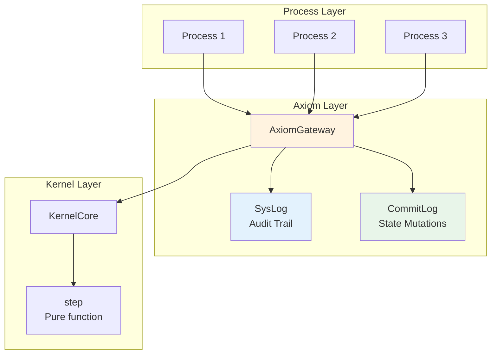
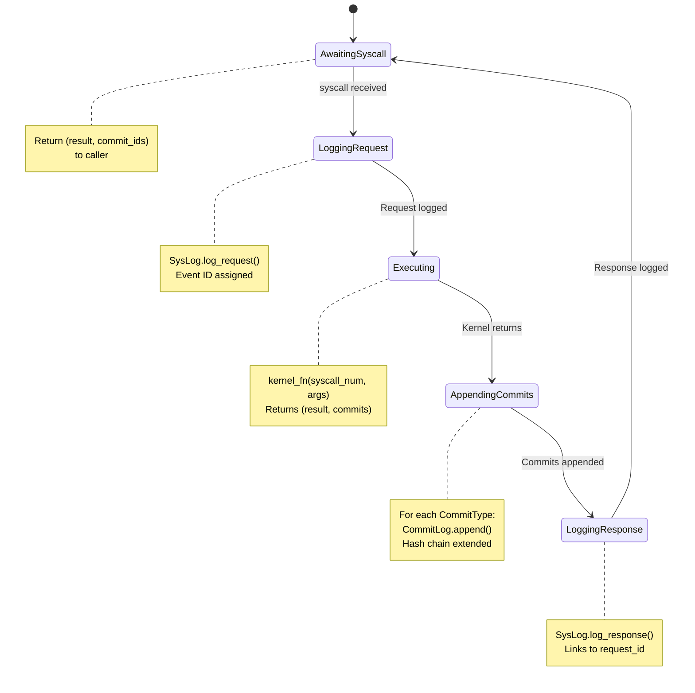

# 03 - Axiom Verification Layer

> Axiom is the single gateway for all syscalls, providing audit logging and deterministic replay.

## Overview

The Axiom layer sits between processes and the kernel, ensuring every operation is:

1. **Logged**: Every syscall request/response is recorded in SysLog
2. **Auditable**: Complete trace of system activity
3. **Replayable**: State mutations recorded in CommitLog enable deterministic reconstruction

### Core Guarantee

```
State = reduce(genesis, CommitLog) → current_state
```

The same CommitLog always produces the same state.

### Goals

- **Audit trail**: Complete record of all syscall activity
- **Deterministic replay**: Reconstruct exact state from CommitLog
- **Integrity verification**: Hash-chained commits detect tampering
- **Separation of concerns**: Audit (SysLog) vs Replay (CommitLog)

### Non-Goals

- Message content storage (privacy/size reasons)
- Real-time intrusion detection (policy is userspace)
- Long-term archival (in-memory with trim)

## Architecture Diagram



## Interfaces

### AxiomGateway

```rust
/// Axiom gateway: Entry point for all syscalls.
///
/// All syscalls flow through the gateway, which:
/// - Records requests and responses to SysLog (audit)
/// - Records state mutations to CommitLog (replay)
pub struct AxiomGateway {
    syslog: SysLog,
    commitlog: CommitLog,
}

impl AxiomGateway {
    /// Create a new Axiom gateway.
    pub fn new(timestamp: u64) -> Self;

    /// Process a syscall through Axiom.
    ///
    /// Flow:
    /// 1. Log syscall request to SysLog
    /// 2. Execute kernel function (provided by caller)
    /// 3. Append commits to CommitLog
    /// 4. Log syscall response to SysLog
    pub fn syscall<F>(
        &mut self,
        sender: ProcessId,
        syscall_num: u32,
        args: [u32; 4],
        timestamp: u64,
        kernel_fn: F,
    ) -> (i64, Vec<CommitId>)
    where
        F: FnMut(u32, [u32; 4]) -> (i64, Vec<CommitType>);

    /// Append a commit directly (bypassing SysLog).
    /// For internal kernel operations not from syscalls.
    pub fn append_internal_commit(&mut self, commit_type: CommitType, timestamp: u64) -> CommitId;

    /// Verify integrity of both logs.
    pub fn verify_integrity(&self) -> bool;
}
```

### SysLog (Audit Trail)

```rust
/// System event (syscall request or response).
pub struct SysEvent {
    pub id: EventId,           // Monotonic event ID
    pub sender: ProcessId,
    pub timestamp: u64,
    pub event_type: SysEventType,
}

pub enum SysEventType {
    Request {
        syscall_num: u32,
        args: [u32; 4],
    },
    Response {
        request_id: EventId,  // Correlates with request
        result: i64,
    },
}

/// System event log for auditing.
pub struct SysLog {
    events: Vec<SysEvent>,
    next_id: EventId,
}

impl SysLog {
    pub fn log_request(&mut self, sender: ProcessId, syscall_num: u32, args: [u32; 4], timestamp: u64) -> EventId;
    pub fn log_response(&mut self, sender: ProcessId, request_id: EventId, result: i64, timestamp: u64);
    pub fn events(&self) -> &[SysEvent];
    pub fn get_range(&self, start_id: EventId, end_id: EventId) -> Vec<&SysEvent>;
    pub fn get_recent(&self, count: usize) -> Vec<&SysEvent>;
}
```

### CommitLog (State Mutations)

```rust
/// A state mutation record.
pub struct Commit {
    pub id: CommitId,           // Hash of this commit
    pub prev_commit: CommitId,  // Hash chain
    pub seq: u64,               // Sequence number
    pub timestamp: u64,
    pub commit_type: CommitType,
    pub caused_by: Option<EventId>,  // Link to SysLog event
}

/// Types of state mutations.
pub enum CommitType {
    Genesis,
    ProcessCreated { pid: ProcessId, parent: ProcessId, name: String },
    ProcessExited { pid: ProcessId, code: i32 },
    ProcessFaulted { pid: ProcessId, reason: u32, description: String },
    CapInserted { pid: ProcessId, slot: CapSlot, cap_id: u64, object_type: u8, object_id: u64, perms: u8 },
    CapRemoved { pid: ProcessId, slot: CapSlot },
    CapGranted { from_pid: ProcessId, to_pid: ProcessId, from_slot: CapSlot, to_slot: CapSlot, new_cap_id: u64, perms: Permissions },
    EndpointCreated { id: EndpointId, owner: ProcessId },
    EndpointDestroyed { id: EndpointId },
    MessageSent { from_pid: ProcessId, to_endpoint: EndpointId, tag: u32, size: usize },
}

/// Commit log for deterministic replay.
pub struct CommitLog {
    commits: Vec<Commit>,
    next_seq: u64,
    last_hash: CommitId,
}

impl CommitLog {
    pub fn new(timestamp: u64) -> Self;  // Creates Genesis commit
    pub fn append(&mut self, commit_type: CommitType, caused_by: Option<EventId>, timestamp: u64) -> CommitId;
    pub fn commits(&self) -> &[Commit];
    pub fn head(&self) -> CommitId;
    pub fn current_seq(&self) -> u64;
    pub fn verify_integrity(&self) -> bool;
}
```

## State Machine

### Syscall Flow Through Axiom



### Commit Hash Chain

```mermaid
stateDiagram-v2
    direction LR
    
    GENESIS[Genesis<br/>prev: [0; 32]<br/>seq: 0] --> COMMIT1[Commit 1<br/>prev: hash(Genesis)<br/>seq: 1]
    COMMIT1 --> COMMIT2[Commit 2<br/>prev: hash(C1)<br/>seq: 2]
    COMMIT2 --> COMMITN[Commit N<br/>prev: hash(C(N-1))<br/>seq: N]
    COMMITN --> HEAD[HEAD<br/>= hash(CN)]
```



## Two-Log Model

| Property | SysLog | CommitLog |
|----------|--------|-----------|
| **Purpose** | Audit trail | State reconstruction |
| **Contents** | Request + Response pairs | State mutations only |
| **Used for Replay** | No | Yes |
| **Deletable** | Yes (without state loss) | No (state is lost) |
| **Hash Chain** | No (sequential IDs only) | Yes (integrity verification) |
| **Message Content** | No (syscall args only) | No (metadata only) |

### Why Two Logs?

1. **SysLog is expendable**: Can be trimmed or deleted without affecting system state. Only needed for debugging/auditing.

2. **CommitLog is essential**: Deleting commits loses the ability to reconstruct state. Must be preserved.

3. **Different retention**: SysLog can be short-term (10K events), CommitLog needs longer retention.

4. **Different queries**: SysLog is queried by time/process, CommitLog is replayed sequentially.

## Hash Chain Integrity

The CommitLog uses FNV-1a hash for `no_std` compatibility. Each commit's hash includes:

- Previous commit hash
- Sequence number
- Timestamp
- Commit type discriminant
- Type-specific data (PIDs, slot numbers, etc.)

```rust
/// Verify hash chain integrity.
pub fn verify_integrity(&self) -> bool {
    let mut expected_prev = [0u8; 32];  // Genesis has zero prev
    
    for commit in &self.commits {
        if commit.prev_commit != expected_prev {
            return false;
        }
        let computed_hash = Self::compute_hash(commit);
        if computed_hash != commit.id {
            return false;
        }
        expected_prev = commit.id;
    }
    
    expected_prev == self.last_hash
}
```

## Replay

The replay module enables state reconstruction from commits. This is essential for:
- Boot-time verification on QEMU (verify persisted CommitLog)
- Crash recovery (reconstruct state from disk)
- Debugging (replay to specific point in time)

### Replayable Trait

```rust
/// Trait for types that can be reconstructed from commits.
pub trait Replayable {
    /// Apply a single commit to this state.
    fn apply(&mut self, commit: &Commit) -> Result<(), ReplayError>;
    
    /// Reset to genesis state.
    fn reset(&mut self);
}
```

### Replay Functions

```rust
/// Replay commits to reconstruct state.
pub fn replay<S: Replayable>(commits: &[Commit]) -> Result<S, ReplayError>;

/// Apply a single commit to state.
pub fn apply_commit<S: Replayable>(state: &mut S, commit: &Commit) -> Result<(), ReplayError>;

/// Replay and verify against expected final hash.
///
/// This is the primary entry point for boot-time verification.
pub fn replay_and_verify<H: HAL>(
    system: &mut System<H>,
    commits: &[Commit],
    expected_hash: [u8; 32],
) -> Result<(), ReplayError> {
    // Apply each commit to the system
    for commit in commits {
        system.apply_commit(commit)?;
    }
    
    // Verify final state hash matches expected
    let actual_hash = system.state_hash();
    if actual_hash != expected_hash {
        return Err(ReplayError::HashMismatch {
            expected: expected_hash,
            actual: actual_hash,
        });
    }
    
    Ok(())
}
```

### State Hash

```rust
// crates/zos-kernel/src/system/mod.rs

impl<H: HAL> System<H> {
    /// Compute a deterministic hash of current kernel state.
    ///
    /// Includes: processes, capability spaces, endpoints, counters.
    /// Used for replay verification.
    pub fn state_hash(&self) -> [u8; 32] {
        // FNV-1a hash of serialized state
    }
}
```

### Replay Properties

1. **Deterministic**: Same commits → same state
2. **Order-dependent**: Commits must be applied in sequence order
3. **Idempotent**: Replaying N commits produces same state as replaying N-1 then 1
4. **Verifiable**: State hash after replay must match persisted hash

## Invariants

| # | Invariant | Enforcement |
|---|-----------|-------------|
| 1 | All authority flows through Axiom | `syscall()` is THE entry point |
| 2 | State mutated only by commits | Kernel returns `Vec<CommitType>` |
| 3 | Everything observable | SysLog records all requests/responses |
| 9 | Axiom is single syscall gateway | No bypass paths exist |
| 10 | Sender identity non-spoofable | Sender passed by trusted caller (System) |
| 11 | Two-Log Model mandatory | SysLog for audit, CommitLog for replay |
| 12 | SysEvents ≠ state changes | Commits may be zero, one, or many per syscall |
| 25 | CommitLog is source of truth | Same CommitLog → same state |
| 26 | SysLog is discardable | Can be deleted without affecting correctness |
| 27 | System state reconstructible | `reduce(genesis, CommitLog) → state` |

## Resource Limits

| Resource | Limit | Behavior |
|----------|-------|----------|
| SysLog events | 10,000 | Oldest events trimmed |
| CommitLog commits | 100,000 | Oldest commits trimmed |

## Platform Notes

### WASM (Phase 1)

- Logs stored in WASM linear memory
- No persistence (logs lost on reload)
- Useful for debugging during development

### QEMU (Phase 2)

- CommitLog persisted to VirtIO block storage on shutdown
- On boot: replay_and_verify() reconstructs and validates state
- SysLog stored in memory (not persisted)
- State hash computed via FNV-1a for `no_std` compatibility

### Bare Metal (Phase 3)

- CommitLog written to NVMe/SATA on shutdown
- Crash recovery via CommitLog replay
- SysLog could stream to external monitoring via serial

## Implementation References

| Component | Source File | Description |
|-----------|-------------|-------------|
| AxiomGateway | `crates/zos-axiom/src/gateway.rs` | Main entry point |
| SysLog | `crates/zos-axiom/src/syslog.rs` | Audit trail |
| CommitLog | `crates/zos-axiom/src/commitlog.rs` | State mutations |
| CommitType | `crates/zos-axiom/src/commitlog.rs` | Mutation types |
| Replay | `crates/zos-axiom/src/replay.rs` | State reconstruction |
| Capability | `crates/zos-axiom/src/capability.rs` | Re-export from kernel-core |
| Types | `crates/zos-axiom/src/types.rs` | ID types |

## Related Specs

- [02-kernel.md](02-kernel.md) - Kernel emits commits via step function
- [04-init-supervisor.md](04-init-supervisor.md) - Init syscalls flow through Axiom
- [README.md](README.md) - System architecture showing Axiom position
