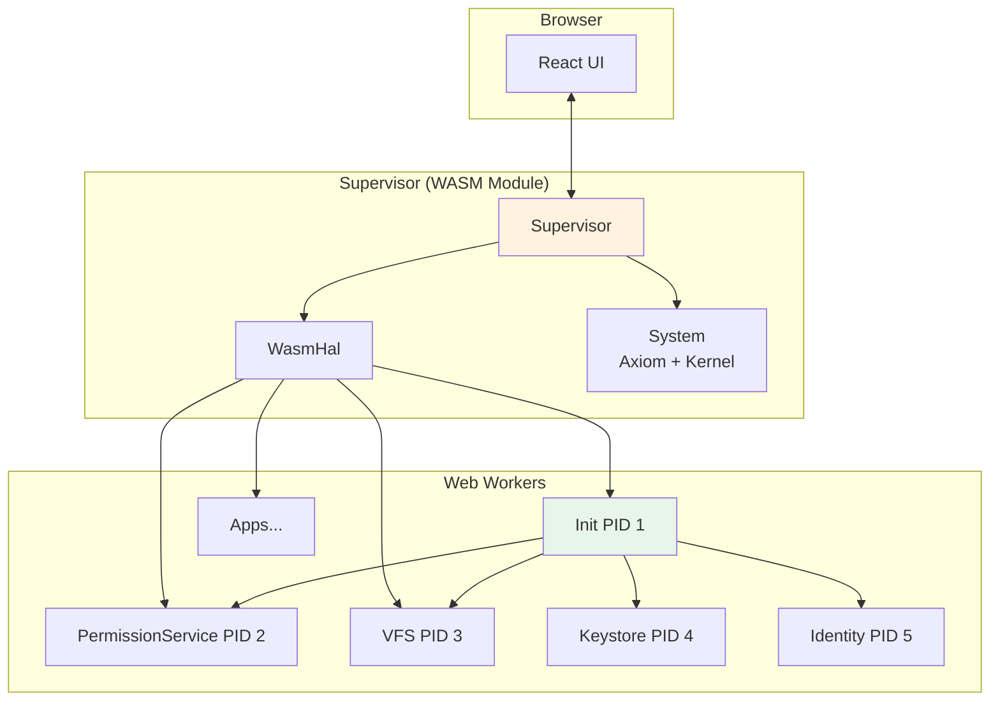
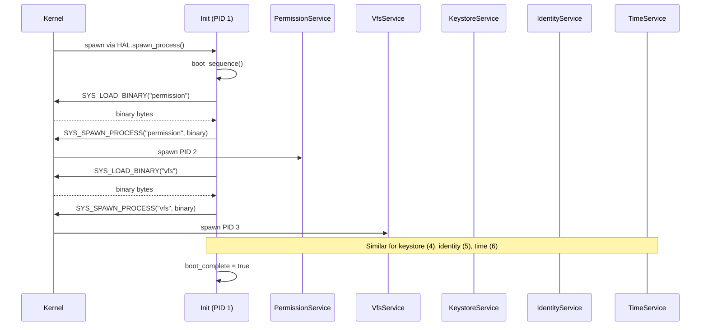
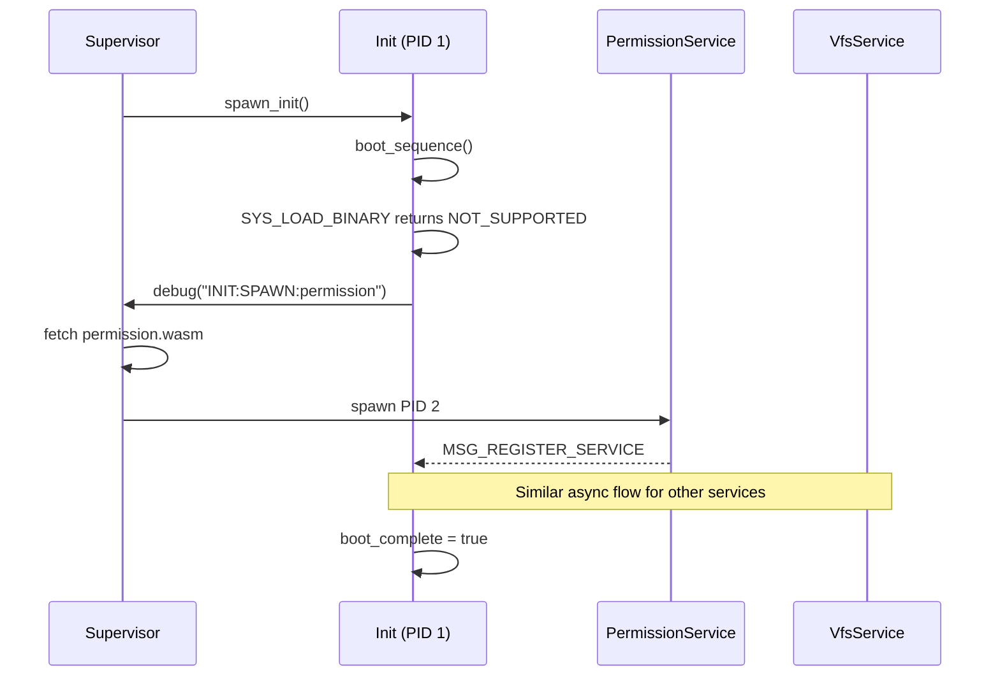
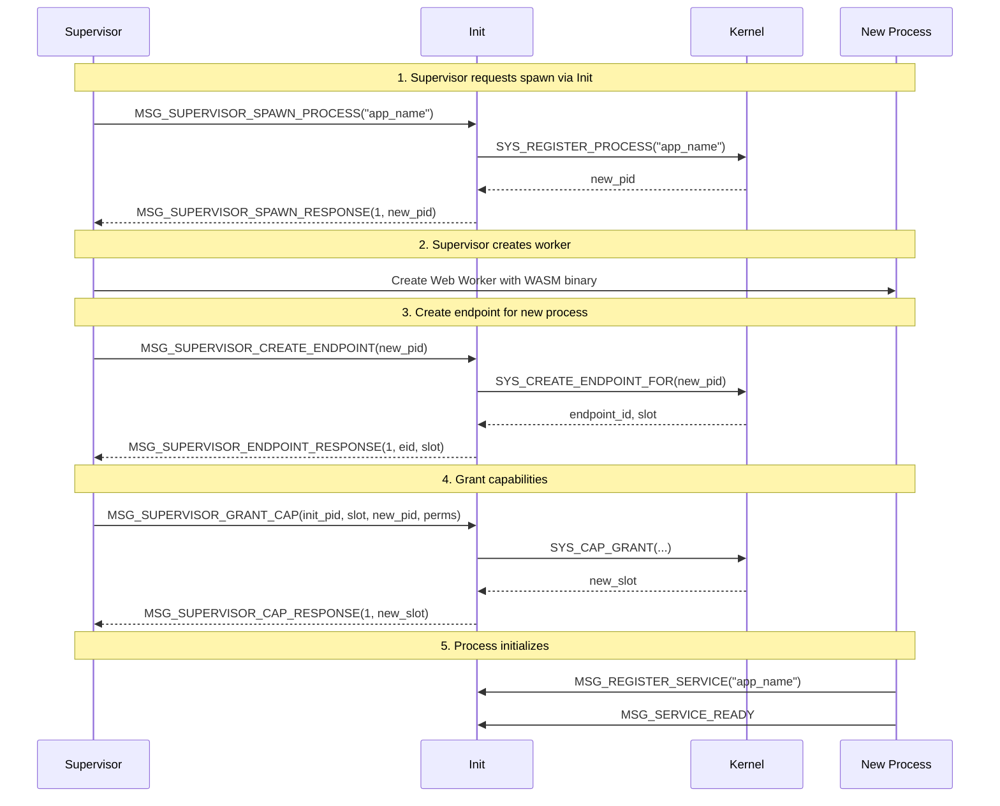
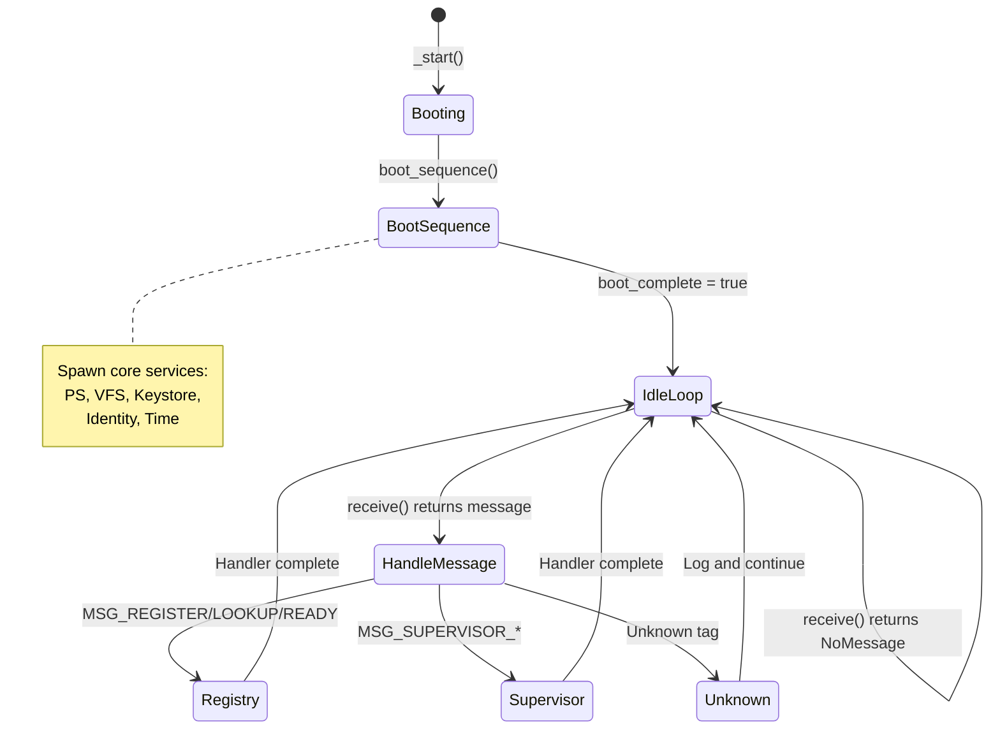
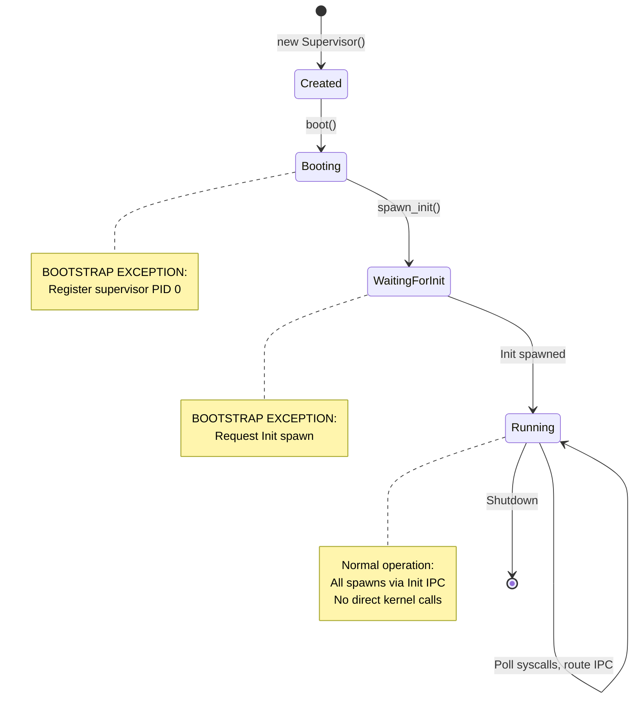

# 04 - Init Process and Supervisor Boundary

> Init (PID 1) is the service registry and IPC router. The Supervisor is a thin transport boundary with no authority.

## Overview

This section covers two closely related components:

- **Init (PID 1)**: First user-space process, handles service registration and IPC routing
- **Supervisor**: Thin transport layer between web client and processes (WASM platform only)

### Goals

- **Service discovery**: Name → endpoint mapping for all services
- **IPC routing**: Route messages between supervisor and processes via Init
- **Bootstrap**: Spawn core services in correct order
- **Minimal privilege**: Supervisor has no ambient authority

### Non-Goals

- Policy enforcement (that's PermissionService)
- Direct kernel access (that's via Axiom)
- Process isolation (that's HAL/platform)

## Architecture Diagram



## Init Process

### Responsibilities

1. **Service Registry**: Maintain `name → (pid, endpoint_id, ready)` mapping
2. **IPC Routing**: Route supervisor messages to appropriate services
3. **Bootstrap**: Spawn core services in dependency order
4. **Ready Tracking**: Track when services have completed initialization

### State

```rust
pub struct Init {
    /// Service registry: name → info
    pub services: BTreeMap<String, ServiceInfo>,
    /// Service input capability slots: service_pid → slot
    pub service_cap_slots: BTreeMap<u32, u32>,
    /// Service VFS response slots: service_pid → slot
    pub service_vfs_slots: BTreeMap<u32, u32>,
    /// Our endpoint slot
    pub endpoint_slot: u32,
    /// Boot sequence complete
    pub boot_complete: bool,
}

pub struct ServiceInfo {
    pub pid: u32,
    pub endpoint_id: u64,
    pub ready: bool,
}
```

### Boot Sequence

The boot sequence differs between platforms:

#### QEMU (Pure Microkernel Model)



#### WASM (Supervisor Async Model)



### Service Protocol

| Message | Tag | Direction | Payload |
|---------|-----|-----------|---------|
| `MSG_REGISTER_SERVICE` | 0x1000 | Service → Init | `[name_len, name, endpoint_low, endpoint_high]` |
| `MSG_LOOKUP_SERVICE` | 0x1001 | Process → Init | `[name_len, name]` |
| `MSG_LOOKUP_RESPONSE` | 0x1002 | Init → Process | `[found, endpoint_low, endpoint_high]` |
| `MSG_SPAWN_SERVICE` | 0x1003 | Process → Init | `[name_len, name]` |
| `MSG_SERVICE_READY` | 0x1005 | Service → Init | (empty) |

## Supervisor Boundary

### Responsibilities

1. **Transport Only**: Relay data between web client and processes via IPC
2. **No Policy**: No permission checks, no authority decisions
3. **No Kernel Calls**: After bootstrap, all operations via IPC to Init

### Bootstrap Exception

The supervisor makes **two direct kernel calls** during bootstrap:

| Operation | When | Why |
|-----------|------|-----|
| Register supervisor (PID 0) | `boot()` | Supervisor needs entry in process table to hold capabilities |
| Request Init spawn | `spawn_init()` | Init cannot spawn itself |

These are **documented exceptions** to the normal flow. After Init starts, all process spawning goes through Init.

### Supervisor → Init Protocol

| Message | Tag | Payload | Purpose |
|---------|-----|---------|---------|
| `MSG_SUPERVISOR_CONSOLE_INPUT` | 0x2001 | `[target_pid, slot, len, data]` | Deliver keyboard input |
| `MSG_SUPERVISOR_KILL_PROCESS` | 0x2002 | `[target_pid]` | Request process termination |
| `MSG_SUPERVISOR_IPC_DELIVERY` | 0x2003 | `[target_pid, slot, tag, len, data]` | Route IPC message |
| `MSG_SUPERVISOR_SPAWN_PROCESS` | 0x2004 | `[name_len, name]` | Request process registration |
| `MSG_SUPERVISOR_SPAWN_RESPONSE` | 0x2005 | `[success, pid]` | Spawn result |
| `MSG_SUPERVISOR_CREATE_ENDPOINT` | 0x2006 | `[target_pid]` | Create endpoint for process |
| `MSG_SUPERVISOR_ENDPOINT_RESPONSE` | 0x2007 | `[success, endpoint_id, slot]` | Endpoint creation result |
| `MSG_SUPERVISOR_GRANT_CAP` | 0x2008 | `[from_pid, from_slot, to_pid, perms]` | Grant capability |
| `MSG_SUPERVISOR_CAP_RESPONSE` | 0x2009 | `[success, new_slot]` | Grant result |
| `MSG_SUPERVISOR_REVOKE_CAP` | 0x2020 | `[target_pid, slot, reason]` | Revoke capability (via PS) |

### Init-Driven Spawn Protocol

All process spawning after bootstrap follows this protocol:



## State Machine

### Init Message Loop



### Supervisor Lifecycle



## Well-Known Processes

| PID | Process | Spawned By | Purpose |
|-----|---------|------------|---------|
| 0 | Supervisor/Kernel | Bootstrap | Transport boundary (WASM) / Kernel (QEMU) |
| 1 | Init | Supervisor (bootstrap) | Service registry, IPC routing |
| 2 | PermissionService | Init | Capability policy |
| 3 | VfsService | Init | Virtual filesystem |
| 4 | KeystoreService | Init | Secure key storage |
| 5 | IdentityService | Init | User/session management |
| 6 | TimeService | Init | Time settings |

> **Note**: PIDs are assigned in spawn order. Terminal is no longer auto-spawned at boot; it's spawned per-window by the Desktop component.

## Invariants

| # | Invariant | Enforcement |
|---|-----------|-------------|
| 13 | Supervisor is thin transport | No policy, no authority, no kernel calls after bootstrap |
| 14 | Supervisor has no ambient authority | Cannot mint/modify/revoke capabilities |
| 15 | Supervisor is not security boundary | Compromise only affects message routing |
| 16 | Supervisor cannot bypass Axiom | All syscalls go through System.process_syscall() |

### Init Kill Exception

Init (PID 1) cannot be killed via IPC because it's the IPC routing hub. The supervisor has a `kill_process_direct()` method used **only** for:

1. Terminating Init itself (shutdown)
2. Bootstrap failures before Init is fully spawned

This is an **architectural necessity**, not a violation.

## Pure Microkernel Spawn Model

The Init process uses a platform-adaptive spawn approach:

```rust
// crates/zos-init/src/bootstrap.rs

impl Init {
    /// Spawn a service using the pure microkernel approach.
    fn spawn_service(&mut self, name: &str) {
        // Try pure microkernel approach first (works on QEMU)
        match syscall::load_binary(name) {
            Ok(binary) => {
                // QEMU path: Got binary, spawn directly via syscall
                self.log(&format!("Loaded {} ({} bytes)", name, binary.len()));
                
                match syscall::spawn_process(name, &binary) {
                    Ok(pid) => {
                        self.log(&format!("Spawned {} as PID {}", name, pid));
                        
                        // Setup endpoint and capability for the new process
                        if let Ok((endpoint_id, slot)) = syscall::create_endpoint_for(pid) {
                            self.service_cap_slots.insert(pid, slot);
                        }
                    }
                    Err(e) => self.log(&format!("Failed to spawn {}: error {}", name, e)),
                }
            }
            Err(e) if e == syscall_error::NOT_SUPPORTED => {
                // WASM path: Binary loading not supported on this platform
                // Fall back to Supervisor async flow via debug message
                self.log(&format!("Platform uses async spawn for {}", name));
                syscall::debug(&format!("INIT:SPAWN:{}", name));
            }
            Err(e) => {
                // Unexpected error (e.g., NOT_FOUND on QEMU means missing binary)
                self.log(&format!("Failed to load {}: error {}", name, e));
            }
        }
    }
}
```

### Terminal Spawning

Terminal is no longer auto-spawned at boot. Instead:

1. Desktop component calls `launchTerminal()` 
2. Creates a new Terminal process via Supervisor
3. Links the process to a window for lifecycle management
4. Each terminal window has its own isolated process

This enables proper process isolation (each window = separate process).

## Platform Notes

### WASM (Phase 1)

- Supervisor runs in main browser thread
- Init and services run in Web Workers
- IPC via SharedArrayBuffer + Atomics
- Spawn requests sent as debug messages (`INIT:SPAWN:{name}`), intercepted by React/Supervisor
- `SYS_LOAD_BINARY` returns `NOT_SUPPORTED`

### QEMU (Phase 2)

- Kernel runs directly (no separate supervisor)
- Init spawns services via `SYS_LOAD_BINARY` + `SYS_SPAWN_PROCESS` syscalls
- Embedded WASM binaries via `include_bytes!()` in HAL
- Services run as WASM modules in wasmi interpreter
- IPC via kernel message queues

### Bare Metal (Phase 3)

- Similar to QEMU but with hardware MMU isolation
- Native process execution (not WASM)
- Direct kernel syscalls

## Implementation References

| Component | Source File | Description |
|-----------|-------------|-------------|
| Init entry | `crates/zos-init/src/lib.rs` | Main loop |
| Boot sequence | `crates/zos-init/src/bootstrap.rs` | Service spawning |
| Service registry | `crates/zos-init/src/registry.rs` | Name → endpoint |
| Supervisor handlers | `crates/zos-init/src/handlers/supervisor.rs` | MSG_SUPERVISOR_* |
| Supervisor boot | `crates/zos-supervisor/src/supervisor/boot.rs` | Bootstrap |
| Supervisor spawn | `crates/zos-supervisor/src/supervisor/spawn.rs` | Process spawning |
| IPC constants | `crates/zos-ipc/src/lib.rs` | Message tags |

## Related Specs

- [00-boot.md](00-boot.md) - Boot sequence spawns Init
- [02-kernel.md](02-kernel.md) - Kernel provides process/IPC primitives
- [03-axiom.md](03-axiom.md) - All syscalls flow through Axiom
- [05-identity.md](05-identity.md) - IdentityService spawned by Init
- [06-services.md](06-services.md) - VFS, Keystore, Time services spawned by Init
