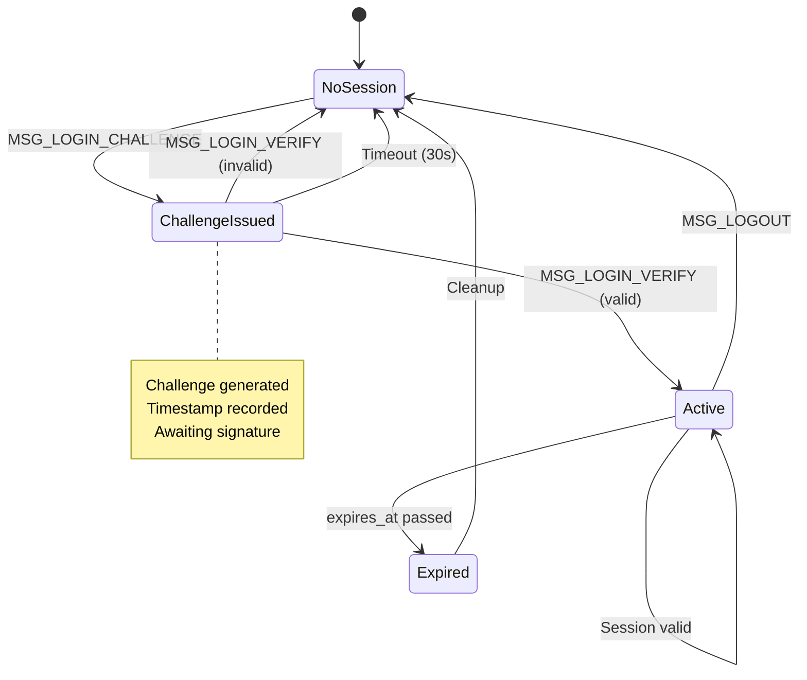
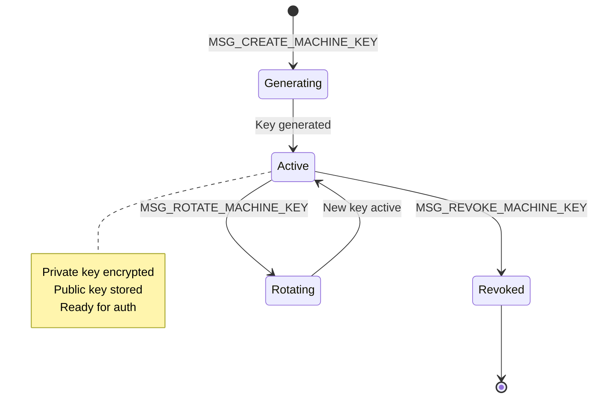

# 05 - Identity Layer

> User-facing identity management: users, sessions, keys, and permissions.

## Overview

The Identity layer provides user-centric security services:

- **Users**: User primitive backed by Zero-ID identities
- **Sessions**: Local and remote session management
- **KeyStore**: Cryptographic key storage (machine keys, neural keys)
- **Permissions**: Policy enforcement for capability grants

### Goals

- **Offline-first**: Local authentication works without network
- **File-based**: All identity material stored in user home directory
- **Zero-ID integrated**: Cryptographic identity backed by Zero-ID protocol
- **Capability-aware**: Permission policies control capability grants

### Non-Goals

- Centralized authentication servers
- Password-based authentication
- OAuth/OIDC integration (Phase 1)

## Architecture Diagram

```mermaid
graph TB
    subgraph "Identity Layer"
        US[UserService]
        SS[SessionService]
        KS[KeyStoreService]
        PS[PermissionService]
    end

    subgraph "Storage"
        VFS[VFS Service<br/>/home/{user}/.zos/]
        KEYSTORE[Keystore Service<br/>/keys/{user}/]
    end

    subgraph "Consumers"
        APPS[Applications]
        DESKTOP[Desktop]
        TERM[Terminal]
    end

    APPS --> US
    APPS --> PS
    DESKTOP --> SS
    TERM --> US

    US --> VFS
    US --> KEYSTORE
    SS --> VFS
    KS --> KEYSTORE
    PS --> VFS

    style US fill:#e8f5e9
    style SS fill:#e8f5e9
    style KS fill:#e8f5e9
    style PS fill:#e8f5e9
```

## Interfaces

### User Types

```rust
/// User primitive
pub struct User {
    pub id: UserId,
    pub display_name: String,
    pub status: UserStatus,
    pub created_at: u64,
    pub last_login: Option<u64>,
    pub preferences: UserPreferences,
}

pub type UserId = u128;  // 128-bit Zero-ID

pub enum UserStatus {
    Active,
    Locked,
    Disabled,
}

pub struct UserPreferences {
    pub theme: String,
    pub language: String,
    pub timezone: String,
}
```

### Session Types

```rust
/// Local session (device-bound)
pub struct LocalSession {
    pub id: SessionId,
    pub user_id: UserId,
    pub device_id: String,
    pub created_at: u64,
    pub expires_at: Option<u64>,
    pub metadata: SessionMetadata,
}

/// Remote auth state (for Zero-ID server)
pub struct RemoteAuthState {
    pub challenge: [u8; 32],
    pub timestamp: u64,
    pub machine_key_id: String,
}

pub struct SessionMetadata {
    pub device_name: String,
    pub platform: String,
    pub location: Option<String>,
}
```

### Key Types

```rust
/// Machine key record (updated format v0.1.3)
pub struct MachineKeyRecord {
    pub machine_id: u128,                       // Machine ID (hex string for JS interop)
    pub signing_public_key: [u8; 32],           // Ed25519 signing public key
    pub encryption_public_key: [u8; 32],        // X25519 encryption public key
    pub signing_sk: Option<[u8; 32]>,           // Signing secret key (secure storage)
    pub encryption_sk: Option<[u8; 32]>,        // Encryption secret key (secure storage)
    pub authorized_at: u64,                     // When authorized
    pub authorized_by: u128,                    // Who authorized (user_id or machine_id)
    pub capabilities: MachineKeyCapabilities,   // String array format
    pub machine_name: Option<String>,           // Human-readable name
    pub last_seen_at: u64,                      // Last activity timestamp
    pub epoch: u64,                             // Key epoch (increments on rotation)
    pub key_scheme: KeyScheme,                  // Classical or PqHybrid
    pub pq_signing_public_key: Option<Vec<u8>>, // ML-DSA-65 (1952 bytes, PqHybrid only)
    pub pq_encryption_public_key: Option<Vec<u8>>, // ML-KEM-768 (1184 bytes, PqHybrid only)
}

pub enum KeyScheme {
    Classical,  // Ed25519 signing + X25519 encryption (default)
    PqHybrid,   // Ed25519/X25519 + ML-DSA-65/ML-KEM-768 (post-quantum)
}
```

### Machine Key Capabilities (String Array Format)

Capabilities are now stored as a string array for extensibility:

```rust
/// Capabilities of machine-level keys (v0.1.3 format)
pub struct MachineKeyCapabilities {
    pub capabilities: Vec<String>,  // ["AUTHENTICATE", "SIGN", "ENCRYPT", ...]
    pub expires_at: Option<u64>,    // Expiry time (None = no expiry)
}

/// Capability string constants
pub mod capability {
    pub const AUTHENTICATE: &str = "AUTHENTICATE";    // Sign auth challenges
    pub const SIGN: &str = "SIGN";                    // Sign messages
    pub const ENCRYPT: &str = "ENCRYPT";              // Encrypt/decrypt data
    pub const SVK_UNWRAP: &str = "SVK_UNWRAP";        // Unwrap Storage Vault Key
    pub const MLS_MESSAGING: &str = "MLS_MESSAGING";  // MLS messaging participation
    pub const VAULT_OPERATIONS: &str = "VAULT_OPERATIONS";   // Vault operations
    pub const AUTHORIZE_MACHINES: &str = "AUTHORIZE_MACHINES"; // Authorize new machines
    pub const REVOKE_MACHINES: &str = "REVOKE_MACHINES";       // Revoke other machines
}
```

**JSON Format:**

```json
{
  "capabilities": ["AUTHENTICATE", "SIGN", "ENCRYPT"],
  "expires_at": null
}
```

**Backward Compatibility:** The deserializer also accepts the legacy boolean format:

```json
{
  "can_authenticate": true,
  "can_encrypt": true,
  "can_sign_messages": false,
  "can_authorize_machines": false,
  "can_revoke_machines": false,
  "expires_at": null
}
```

### Neural Key Shard Storage

```rust
/// Encrypted shard storage for Neural Key (social recovery)
pub struct EncryptedShardStore {
    pub user_id: u128,                       // User ID
    pub encrypted_shards: Vec<EncryptedShard>, // 2 of 5 shards (encrypted)
    pub external_shard_indices: Vec<u8>,     // Indices shown to user [1, 2, 3]
    pub kdf: KeyDerivation,                  // Argon2id parameters
    pub created_at: u64,
}

pub struct EncryptedShard {
    pub index: u8,           // Shard index (1-5)
    pub ciphertext: Vec<u8>, // AES-256-GCM encrypted
    pub nonce: [u8; 12],     // GCM nonce
    pub tag: [u8; 16],       // GCM auth tag
}
```

Storage path: `/keys/{user_id}/identity/encrypted_shards.json`

### Service Traits

```rust
/// User management
pub trait UserService {
    fn create_user(&mut self, display_name: &str) -> Result<User, UserError>;
    fn get_user(&self, id: UserId) -> Result<Option<User>, UserError>;
    fn list_users(&self) -> Result<Vec<User>, UserError>;
    fn delete_user(&mut self, id: UserId) -> Result<(), UserError>;
}

/// Session management
pub trait SessionService {
    fn create_session(&mut self, user_id: UserId) -> Result<LocalSession, SessionError>;
    fn validate_session(&self, session_id: &SessionId) -> Result<bool, SessionError>;
    fn end_session(&mut self, session_id: &SessionId) -> Result<(), SessionError>;
}
```

## IPC Protocol

### User Management (0x7000-0x700F)

| Message | Tag | Payload |
|---------|-----|---------|
| `MSG_CREATE_USER` | 0x7000 | JSON: `{ display_name }` |
| `MSG_CREATE_USER_RESPONSE` | 0x7001 | JSON: `{ user }` or `{ error }` |
| `MSG_GET_USER` | 0x7002 | JSON: `{ user_id }` |
| `MSG_GET_USER_RESPONSE` | 0x7003 | JSON: `{ user }` or `{ error }` |
| `MSG_LIST_USERS` | 0x7004 | (empty) |
| `MSG_LIST_USERS_RESPONSE` | 0x7005 | JSON: `{ users: [] }` |
| `MSG_DELETE_USER` | 0x7006 | JSON: `{ user_id }` |
| `MSG_DELETE_USER_RESPONSE` | 0x7007 | JSON: `{ success }` or `{ error }` |

### Session Management (0x7010-0x701F)

| Message | Tag | Payload |
|---------|-----|---------|
| `MSG_LOGIN_CHALLENGE` | 0x7010 | JSON: `{ user_id, machine_key_id }` |
| `MSG_LOGIN_CHALLENGE_RESPONSE` | 0x7011 | JSON: `{ challenge }` or `{ error }` |
| `MSG_LOGIN_VERIFY` | 0x7012 | JSON: `{ challenge, signature }` |
| `MSG_LOGIN_VERIFY_RESPONSE` | 0x7013 | JSON: `{ session }` or `{ error }` |
| `MSG_LOGOUT` | 0x7014 | JSON: `{ session_id }` |
| `MSG_LOGOUT_RESPONSE` | 0x7015 | JSON: `{ success }` |

### Machine Keys (0x7060-0x706F)

| Message | Tag | Payload |
|---------|-----|---------|
| `MSG_CREATE_MACHINE_KEY` | 0x7060 | JSON: `{ user_id, scheme, name }` |
| `MSG_CREATE_MACHINE_KEY_RESPONSE` | 0x7061 | JSON: `{ key_record }` or `{ error }` |
| `MSG_LIST_MACHINE_KEYS` | 0x7062 | JSON: `{ user_id }` |
| `MSG_LIST_MACHINE_KEYS_RESPONSE` | 0x7063 | JSON: `{ keys: [] }` |
| `MSG_REVOKE_MACHINE_KEY` | 0x7066 | JSON: `{ user_id, key_id }` |
| `MSG_REVOKE_MACHINE_KEY_RESPONSE` | 0x7067 | JSON: `{ success }` or `{ error }` |

### Neural Keys (0x7054-0x7057)

| Message | Tag | Payload |
|---------|-----|---------|
| `MSG_GENERATE_NEURAL_KEY` | 0x7054 | JSON: `{ user_id, guardian_count, threshold }` |
| `MSG_GENERATE_NEURAL_KEY_RESPONSE` | 0x7055 | JSON: `{ shards, public_identifiers }` |
| `MSG_RECOVER_NEURAL_KEY` | 0x7056 | JSON: `{ shards: [...] }` |
| `MSG_RECOVER_NEURAL_KEY_RESPONSE` | 0x7057 | JSON: `{ success, master_key }` or `{ error }` |

## State Machine

### Session Lifecycle



### Machine Key Lifecycle



## File Storage Paths

All identity data stored in user's home directory via VFS:

```
/home/{user_id}/
└── .zos/
    └── identity/
        ├── user.json              # User profile
        ├── preferences.json       # User preferences
        ├── sessions/
        │   └── {session_id}.json  # Session data
        └── machine/
            └── {key_id}.json      # Machine key records
```

Key material stored separately in Keystore (Invariant 32):

```
/keys/{user_id}/
├── identity/
│   └── public_keys.json       # Public identity keys
└── machine/
    └── {machine_id}.json      # Encrypted private keys
```

## Invariants

| # | Invariant | Enforcement |
|---|-----------|-------------|
| 31 | Filesystem through VFS | User data via VFS IPC |
| 32 | Keystore physically separate | Key material in `zos-keystore` database |

### Safety Invariants

- **UserId of 0 forbidden**: Reserved for system
- **Empty keys forbidden**: Ed25519/X25519 require 32 bytes
- **No path traversal**: Paths validated to stay within user home
- **No unvalidated input in paths**: Sanitize before storage

## Platform Notes

### WASM (Phase 1)

- Keys stored in `zos-keystore` IndexedDB
- User data in `zos-storage` IndexedDB
- No hardware security module support

### Native (Phase 2+)

- TPM integration for key protection
- Secure enclave support (future)

## Implementation References

| Component | Source File | Description |
|-----------|-------------|-------------|
| Types | `crates/zos-identity/src/types.rs` | User, session types |
| Keystore | `crates/zos-identity/src/keystore.rs` | Key management |
| Session | `crates/zos-identity/src/session.rs` | Session types |
| Service | `crates/zos-identity/src/service.rs` | Service traits |
| IPC | `crates/zos-identity/src/ipc.rs` | Message types |
| Client | `crates/zos-identity/src/client.rs` | IPC client |
| Paths | `crates/zos-identity/src/paths.rs` | Storage paths |
| IdentityService | `crates/zos-services/src/services/identity/` | Service impl |

## Related Specs

- [04-init-supervisor.md](04-init-supervisor.md) - IdentityService spawned by Init
- [06-services.md](06-services.md) - Keystore and VFS services
- [08-applications.md](08-applications.md) - Apps request identity capabilities
