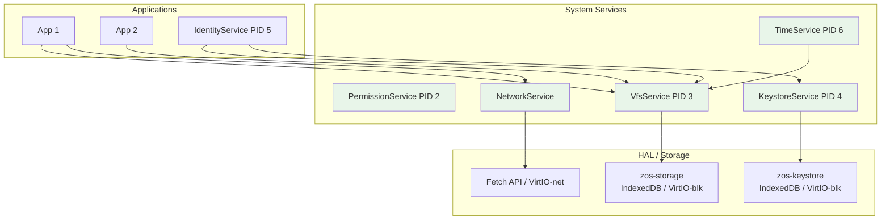
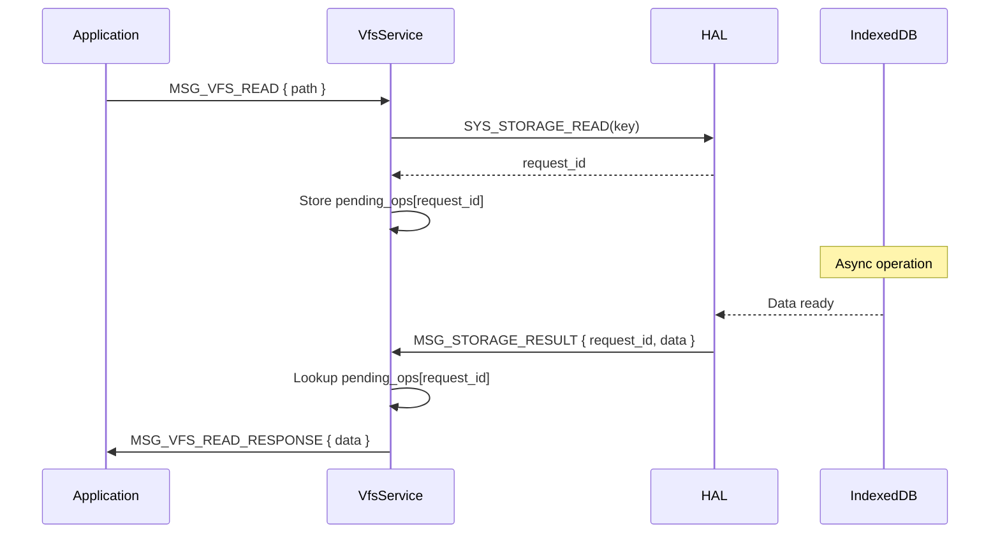
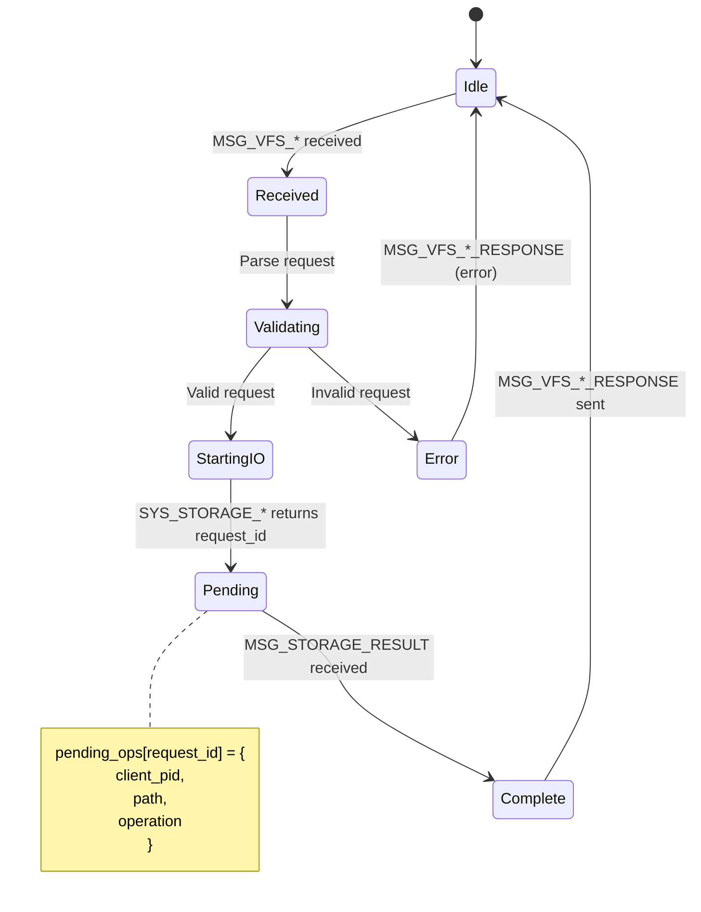

# 06 - System Services

> Userspace services: VFS, Network, Time, and Keystore.

## Overview

Zero OS provides core functionality through userspace services rather than kernel modules. Each service runs as a separate process with its own capabilities.

| Service | PID | Purpose |
|---------|-----|---------|
| PermissionService | 2 | Capability policy enforcement |
| VfsService | 3 | Virtual filesystem operations |
| KeystoreService | 4 | Secure cryptographic key storage |
| IdentityService | 5 | User/session/key management |
| TimeService | 6 | Time settings and timezone |
| NetworkService | — | HTTP/fetch operations (spawned on demand) |

> **Note**: PIDs are assigned in spawn order during Init's boot sequence. NetworkService does not have a fixed PID as it's spawned on demand rather than at boot.

### Goals

- **Userspace policy**: All filesystem/network policy outside kernel
- **Capability-controlled**: Access requires appropriate capabilities
- **Async I/O**: Non-blocking operations with request IDs

### Non-Goals

- Kernel-space drivers
- Real-time networking
- POSIX filesystem semantics

## Architecture Diagram



## VFS Service

### Purpose

Provides filesystem abstraction over platform storage. All file operations flow through VFS IPC.

### IPC Protocol

#### Directory Operations (0x8000-0x800F)

| Message | Tag | Payload |
|---------|-----|---------|
| `MSG_VFS_MKDIR` | 0x8000 | JSON: `{ path }` |
| `MSG_VFS_MKDIR_RESPONSE` | 0x8001 | JSON: `{ success }` or `{ error }` |
| `MSG_VFS_RMDIR` | 0x8002 | JSON: `{ path }` |
| `MSG_VFS_RMDIR_RESPONSE` | 0x8003 | JSON: `{ success }` or `{ error }` |
| `MSG_VFS_READDIR` | 0x8004 | JSON: `{ path }` |
| `MSG_VFS_READDIR_RESPONSE` | 0x8005 | JSON: `{ entries: [] }` |

#### File Operations (0x8010-0x801F)

| Message | Tag | Payload |
|---------|-----|---------|
| `MSG_VFS_WRITE` | 0x8010 | JSON: `{ path, data }` |
| `MSG_VFS_WRITE_RESPONSE` | 0x8011 | JSON: `{ success }` or `{ error }` |
| `MSG_VFS_READ` | 0x8012 | JSON: `{ path }` |
| `MSG_VFS_READ_RESPONSE` | 0x8013 | JSON: `{ data }` or `{ error }` |
| `MSG_VFS_UNLINK` | 0x8014 | JSON: `{ path }` |
| `MSG_VFS_UNLINK_RESPONSE` | 0x8015 | JSON: `{ success }` or `{ error }` |

#### Metadata Operations (0x8020-0x802F)

| Message | Tag | Payload |
|---------|-----|---------|
| `MSG_VFS_STAT` | 0x8020 | JSON: `{ path }` |
| `MSG_VFS_STAT_RESPONSE` | 0x8021 | JSON: `{ inode }` or `{ error }` |
| `MSG_VFS_EXISTS` | 0x8022 | JSON: `{ path }` |
| `MSG_VFS_EXISTS_RESPONSE` | 0x8023 | JSON: `{ exists: bool }` |

### Async Storage Pattern

VFS uses async syscalls that return immediately with a `request_id`:



## Keystore Service

### Purpose

Secure storage for cryptographic key material, physically isolated from general filesystem.

### Why Separate?

- **Security isolation**: Key material never passes through VFS
- **Reduced attack surface**: VFS bugs cannot leak keys
- **Independent lifecycle**: Keys persist across filesystem wipes
- **No filesystem semantics**: Just key-value storage

### IPC Protocol (0xA000-0xA0FF)

| Message | Tag | Payload |
|---------|-----|---------|
| `MSG_KEYSTORE_READ` | 0xA000 | JSON: `{ key }` |
| `MSG_KEYSTORE_READ_RESPONSE` | 0xA001 | JSON: `{ data }` or `{ error }` |
| `MSG_KEYSTORE_WRITE` | 0xA002 | JSON: `{ key, value }` |
| `MSG_KEYSTORE_WRITE_RESPONSE` | 0xA003 | JSON: `{ success }` or `{ error }` |
| `MSG_KEYSTORE_DELETE` | 0xA004 | JSON: `{ key }` |
| `MSG_KEYSTORE_DELETE_RESPONSE` | 0xA005 | JSON: `{ success }` or `{ error }` |
| `MSG_KEYSTORE_EXISTS` | 0xA006 | JSON: `{ key }` |
| `MSG_KEYSTORE_EXISTS_RESPONSE` | 0xA007 | JSON: `{ exists: bool }` |
| `MSG_KEYSTORE_LIST` | 0xA008 | JSON: `{ prefix }` |
| `MSG_KEYSTORE_LIST_RESPONSE` | 0xA009 | JSON: `{ keys: [] }` |

### Key Path Format

Keystore keys follow a convention but are **NOT** filesystem paths:

```
/keys/{user_id}/identity/public_keys.json
/keys/{user_id}/machine/{machine_id}.json
```

## Time Service

### Purpose

Manage time-related settings: 12h/24h format, timezone preferences.

### IPC Protocol (0x8100-0x810F)

| Message | Tag | Payload |
|---------|-----|---------|
| `MSG_GET_TIME_SETTINGS` | 0x8100 | (empty) |
| `MSG_GET_TIME_SETTINGS_RESPONSE` | 0x8101 | JSON: `{ time_format_24h, timezone }` |
| `MSG_SET_TIME_SETTINGS` | 0x8102 | JSON: `{ time_format_24h, timezone }` |
| `MSG_SET_TIME_SETTINGS_RESPONSE` | 0x8103 | JSON: `{ success }` or `{ error }` |

### Persistence

Settings stored via VFS at `/system/settings/time.json`.

## Network Service

### Purpose

Mediate HTTP requests from applications, enforcing network policies.

### IPC Protocol (0x9000-0x901F)

| Message | Tag | Payload |
|---------|-----|---------|
| `MSG_NET_REQUEST` | 0x9000 | JSON: `HttpRequest` |
| `MSG_NET_RESPONSE` | 0x9001 | JSON: `HttpResponse` |
| `MSG_NET_RESULT` | 0x9002 | `[request_id, result_type, len, data]` |

### HttpRequest

```rust
pub struct HttpRequest {
    pub url: String,
    pub method: String,  // GET, POST, etc.
    pub headers: HashMap<String, String>,
    pub body: Option<Vec<u8>>,
}
```

### Async Pattern

Network operations use the same async pattern as storage:
1. `SYS_NETWORK_FETCH` returns `request_id` immediately
2. HAL tracks `pending_network_requests[request_id] = pid`
3. Result delivered via `MSG_NET_RESULT` IPC message

## State Machine

### VFS Operation Lifecycle



## Invariants

| # | Invariant | Enforcement |
|---|-----------|-------------|
| 28 | All storage through HAL | Services use `storage_*_async()` methods |
| 29 | Dual storage objects | `zos-storage` and `zos-keystore` databases |
| 31 | Filesystem through VFS | All file access via VFS IPC |
| 32 | Keystore physically separate | KeystoreService uses `keystore_*_async()` |

## Platform Notes

### WASM (Phase 1)

- **VFS**: `zos-storage` IndexedDB database
- **Keystore**: `zos-keystore` IndexedDB database (separate)
- **Network**: Browser Fetch API

### Native (Phase 2+)

- **VFS**: Native filesystem
- **Keystore**: Encrypted file or TPM
- **Network**: Native HTTP client

## Implementation References

| Component | Source File | Description |
|-----------|-------------|-------------|
| VfsService | `crates/zos-services/src/services/vfs/` | VFS implementation |
| KeystoreService | `crates/zos-services/src/services/keystore/` | Keystore impl |
| TimeService | `crates/zos-services/src/services/time/` | Time settings |
| NetworkService | `crates/zos-services/src/services/network/` | HTTP mediation |
| VFS client | `crates/zos-vfs/src/client/` | VFS IPC client |
| IPC constants | `crates/zos-ipc/src/lib.rs` | Message tags |

## Related Specs

- [04-init-supervisor.md](04-init-supervisor.md) - Services spawned by Init
- [05-identity.md](05-identity.md) - Identity uses VFS and Keystore
- [08-applications.md](08-applications.md) - Apps use services via IPC
