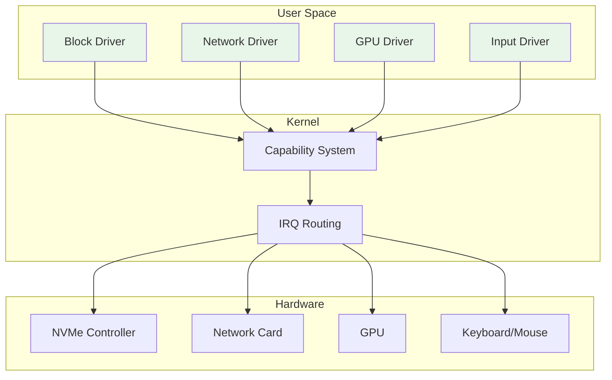
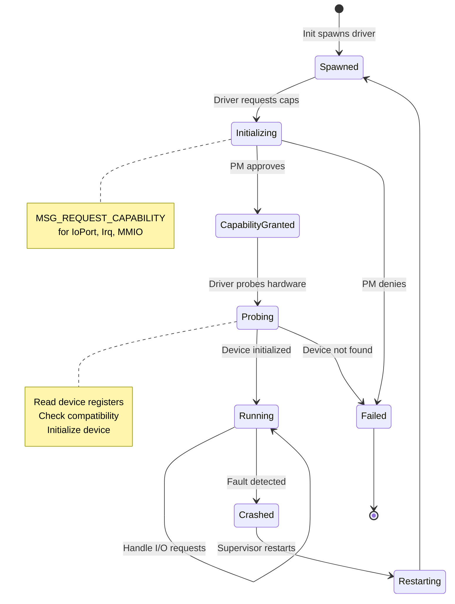

# 07 - User-Space Drivers

> Device drivers run in userspace with capability-controlled hardware access.

## Overview

Zero OS follows a user-space driver model where device drivers run as regular processes with explicit capabilities for hardware access. This reduces kernel complexity and improves fault isolation.

### Goals

- **Minimal kernel**: No driver code in kernel space
- **Fault isolation**: Driver crashes don't bring down the system
- **Capability-controlled**: Hardware access requires explicit grants
- **Platform abstraction**: Same driver model across targets

### Non-Goals

- Real-time driver support (Phase 1)
- Legacy hardware drivers
- In-kernel drivers for any device

## Architecture Diagram



## Current Status (Phase 1)

### WASM Platform

In Phase 1 (WASM), drivers are **not separate processes**. Instead, the browser provides hardware abstraction:

| "Driver" | Implementation |
|----------|---------------|
| Storage | IndexedDB via HAL |
| Network | Fetch API via HAL |
| Graphics | WebGPU via React |
| Input | DOM events via React |

These are **JavaScript adapters** in the supervisor/React layer, not true user-space drivers.

## Future Architecture (Phase 2+)

### Driver Capabilities

Drivers receive restricted capabilities for hardware access:

```rust
pub enum ObjectType {
    // ... existing types ...
    IoPort = 5,    // I/O port range access
    Irq = 4,       // Interrupt handler registration
    Memory = 3,    // MMIO region mapping
}
```

### Capability Grants

```rust
// Grant I/O port range to driver
pub struct IoPortCapability {
    pub start: u16,
    pub end: u16,
    pub permissions: Permissions,  // read, write
}

// Grant IRQ handling to driver
pub struct IrqCapability {
    pub irq_number: u8,
    pub permissions: Permissions,  // can register handler
}

// Grant MMIO region to driver
pub struct MmioCapability {
    pub phys_addr: u64,
    pub size: usize,
    pub permissions: Permissions,  // read, write
}
```

### Driver Lifecycle



## VirtIO Framework (QEMU)

For QEMU target, VirtIO drivers are implemented in the HAL layer for persistent storage.

### Current Implementation

| Device | VirtIO Type | Status | Purpose |
|--------|-------------|--------|---------|
| Block | virtio-blk | ✓ Implemented | CommitLog persistence |
| Network | virtio-net | Planned | Future network I/O |
| Console | virtio-console | N/A | Uses serial port instead |
| RNG | virtio-rng | N/A | Uses RDRAND/TSC |

### VirtIO Block Driver

```rust
// crates/zos-hal/src/x86_64/virtio/mod.rs

/// Initialize VirtIO subsystem
pub fn init() {
    // Scan PCI bus for VirtIO devices
    pci::scan_for_virtio_devices();
    
    // Initialize block device if found
    if let Some(blk_config) = pci::find_virtio_blk() {
        blk::init(blk_config);
    }
}

/// Check if VirtIO block device is initialized
pub fn is_block_device_available() -> bool {
    blk::is_initialized()
}
```

### Storage Module

```rust
// crates/zos-hal/src/x86_64/storage.rs

/// Initialize storage layer (on top of VirtIO block)
pub fn init() -> Result<bool, StorageError> {
    if !virtio::blk::is_initialized() {
        return Err(StorageError::NoDevice);
    }
    // Initialize key-value storage on block device
    Ok(true)
}

/// Read a key-value pair
pub fn read(key: &str) -> Result<Option<Vec<u8>>, StorageError>;

/// Write a key-value pair
pub fn write(key: &str, value: &[u8]) -> Result<(), StorageError>;

/// Delete a key
pub fn delete(key: &str) -> Result<bool, StorageError>;

/// List keys with prefix
pub fn list(prefix: &str) -> Vec<String>;
```

### VirtIO Module Structure

```
crates/zos-hal/src/x86_64/virtio/
├── mod.rs          # VirtIO initialization
├── pci.rs          # PCI device discovery
├── transport.rs    # VirtIO transport abstraction
├── queue.rs        # Virtqueue management
├── blk.rs          # Block device driver
└── blk_pci.rs      # PCI-specific block configuration
```

### VirtIO Driver Trait

```rust
pub trait VirtioDriver {
    /// Probe for device at given transport
    fn probe(&mut self, transport: &dyn VirtioTransport) -> Result<(), DriverError>;
    
    /// Initialize device
    fn init(&mut self) -> Result<(), DriverError>;
    
    /// Handle interrupt
    fn handle_interrupt(&mut self) -> Result<(), DriverError>;
    
    /// Process I/O completion
    fn process_completion(&mut self) -> Result<(), DriverError>;
}
```

## Bare Metal Drivers (Phase 3)

Native hardware drivers for bare metal:

### Planned Drivers

| Driver | Hardware | Phase |
|--------|----------|-------|
| AHCI | SATA controllers | Phase 3 |
| NVMe | NVMe SSDs | Phase 3 |
| xHCI | USB 3.0 | Phase 4 |
| Intel HD | Intel graphics | Phase 4 |

### IOMMU Integration

For DMA-capable devices, IOMMU restricts device memory access:

```
┌──────────────────────────────────────────────────────────────────┐
│                        Physical Memory                            │
├──────────────────────────────────────────────────────────────────┤
│                                                                  │
│   ┌─────────────────┐        ┌─────────────────┐                │
│   │  Driver Buffer  │        │  Other Memory   │                │
│   │  (DMA allowed)  │        │  (DMA blocked)  │                │
│   └────────┬────────┘        └─────────────────┘                │
│            │                                                      │
│            │ IOMMU restricts                                     │
│            │ device access                                        │
│            ▼                                                      │
│   ┌─────────────────┐                                           │
│   │     Device      │                                           │
│   │   (DMA engine)  │                                           │
│   └─────────────────┘                                           │
│                                                                  │
└──────────────────────────────────────────────────────────────────┘
```

## Invariants

| # | Invariant | Enforcement |
|---|-----------|-------------|
| 4 | Kernel minimality | No drivers in kernel |
| 7 | No policy in kernel | Driver loading is userspace policy |
| 17 | Capabilities are primitive | IoPort, Irq, Memory caps only reference HW resources |

## Implementation References

| Component | Source File | Description |
|-----------|-------------|-------------|
| WASM HAL storage | `crates/zos-supervisor/src/hal/storage.rs` | IndexedDB adapter |
| WASM HAL network | `crates/zos-supervisor/src/hal/network.rs` | Fetch adapter |
| HAL trait | `crates/zos-hal/src/lib.rs` | Driver capability types |
| VirtIO init | `crates/zos-hal/src/x86_64/virtio/mod.rs` | VirtIO subsystem |
| VirtIO block | `crates/zos-hal/src/x86_64/virtio/blk.rs` | Block device driver |
| VirtIO PCI | `crates/zos-hal/src/x86_64/virtio/pci.rs` | PCI device discovery |
| VirtIO queue | `crates/zos-hal/src/x86_64/virtio/queue.rs` | Virtqueue management |
| x86_64 storage | `crates/zos-hal/src/x86_64/storage.rs` | Key-value storage |
| PCI enumeration | `crates/zos-hal/src/x86_64/pci.rs` | PCI bus scanning |

## Related Specs

- [01-hal.md](01-hal.md) - HAL provides driver capability types
- [02-kernel.md](02-kernel.md) - Kernel provides IoPort, Irq, Memory object types
- [06-services.md](06-services.md) - Services use drivers via HAL
