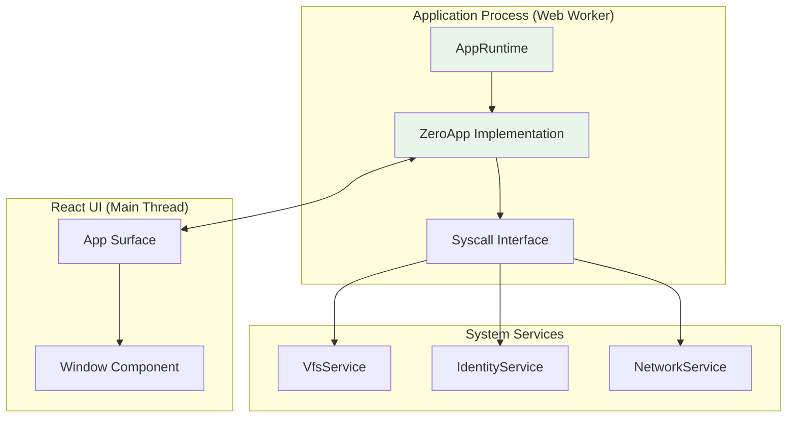
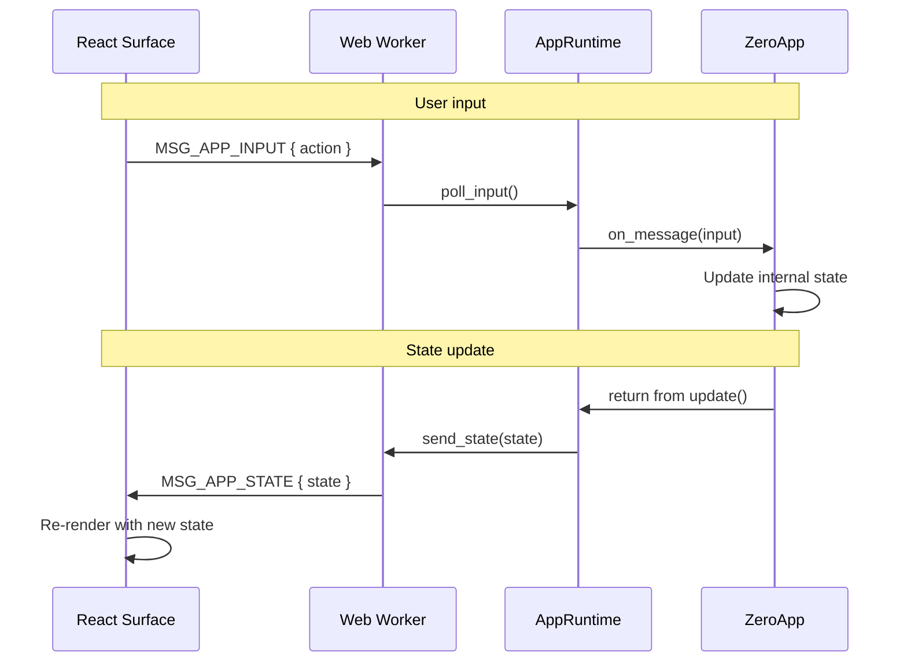
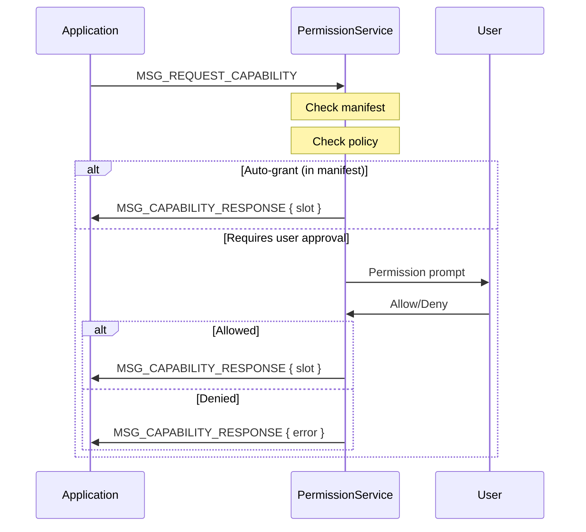

# 08 - ZeroApp Model

> Sandboxed applications with a trait-based runtime and capability-controlled access.

## Overview

Zero OS applications are sandboxed processes that implement the `ZeroApp` trait. Each app runs in isolation with explicit capabilities for system resources.

### Goals

- **Sandbox by default**: Apps have no ambient authority
- **Capability-controlled**: Access requires explicit grants
- **React integration**: UI surfaces rendered by React components
- **State serialization**: Backend → UI state via wire protocol

### Non-Goals

- Native code execution (Phase 1)
- Direct DOM access
- Shared memory between apps

## Architecture Diagram



## Interfaces

### ZeroApp Trait

```rust
/// Core application trait
pub trait ZeroApp: Default {
    /// Application manifest
    fn manifest() -> &'static AppManifest;
    
    /// Initialize the application
    fn init(&mut self, ctx: &AppContext) -> Result<(), AppError>;
    
    /// Update loop (called each frame)
    fn update(&mut self, ctx: &AppContext) -> ControlFlow;
    
    /// Handle incoming IPC message
    fn on_message(&mut self, ctx: &AppContext, msg: Message) -> Result<(), AppError>;
    
    /// Clean shutdown
    fn shutdown(&mut self, ctx: &AppContext);
}

pub enum ControlFlow {
    Continue,
    Yield,
    Exit(i32),
}
```

### AppManifest

```rust
/// Application metadata and capability requests
pub struct AppManifest {
    /// Unique application ID
    pub id: &'static str,
    /// Human-readable name
    pub name: &'static str,
    /// Version string
    pub version: &'static str,
    /// Requested capabilities
    pub capabilities: &'static [CapabilityRequest],
}

/// Capability request
pub struct CapabilityRequest {
    pub object_type: ObjectType,
    pub permissions: Permissions,
    pub description: &'static str,
}
```

### AppContext

```rust
/// Context provided to app methods
pub struct AppContext {
    /// Process ID
    pub pid: u32,
    /// User context (if logged in)
    pub user: Option<UserContext>,
    /// Current session
    pub session: Option<SessionId>,
}

pub struct UserContext {
    pub user_id: UserId,
    pub display_name: String,
    pub permissions: Vec<CapabilityInfo>,
}
```

### AppRuntime

```rust
/// Runtime that hosts a ZeroApp
pub struct AppRuntime {
    pid: u32,
    ui_endpoint: u32,
    input_endpoint: u32,
}

impl AppRuntime {
    /// Run the app loop
    pub fn run<A: ZeroApp>(&mut self, app: A) -> !;
    
    /// Send state update to UI
    pub fn send_state<S: WireSerializable>(&self, state: &S);
    
    /// Receive input from UI
    pub fn poll_input<I: WireSerializable>(&self) -> Option<I>;
}
```

## State Machine

### Application Lifecycle

```mermaid
stateDiagram-v2
    [*] --> Spawned: Worker created
    
    Spawned --> Initializing: _start() called
    note right of Initializing
        AppRuntime created
        ZeroApp::init() called
    end note
    
    Initializing --> Running: Init success
    Initializing --> Failed: Init error
    
    Running --> Running: update() loop
    note right of Running
        1. Poll input messages
        2. Call on_message()
        3. Call update()
        4. Send state to UI
        5. Yield CPU
    end note
    
    Running --> ShuttingDown: ControlFlow::Exit
    Running --> Crashed: Panic/fault
    
    ShuttingDown --> [*]: shutdown() complete
    
    Failed --> [*]: Exit with error
    Crashed --> [*]: Supervisor cleanup
```

### Message Flow



## Wire Protocol

### Message Tags

| Tag | Constant | Direction | Purpose |
|-----|----------|-----------|---------|
| 0x2000 | `MSG_APP_STATE` | Backend → UI | State update |
| 0x2001 | `MSG_APP_INPUT` | UI → Backend | User input |
| 0x2002 | `MSG_UI_READY` | UI → Backend | Surface mounted |
| 0x2003 | `MSG_APP_FOCUS` | Backend → UI | Request focus |
| 0x2004 | `MSG_APP_ERROR` | Backend → UI | Error notification |

### State Serialization

States implement `WireSerializable`:

```rust
/// Trait for wire-format serialization
pub trait WireSerializable: Sized {
    fn to_wire(&self) -> Vec<u8>;
    fn from_wire(data: &[u8]) -> Result<Self, ProtocolError>;
}
```

Envelope format:

```
┌───────────────────────────────────────────────┐
│ version: u8 (current = 1)                     │
├───────────────────────────────────────────────┤
│ type_tag: u16 (identifies state type)         │
├───────────────────────────────────────────────┤
│ payload: [u8] (type-specific data)            │
└───────────────────────────────────────────────┘
```

## Built-in Applications

### Calculator

```rust
pub struct CalculatorState {
    pub display: String,
    pub result: f64,
    pub operator: Option<char>,
    pub clear_on_next: bool,
}
```

### Clock

```rust
pub struct ClockState {
    pub time_str: String,
    pub is_24h: bool,
    pub timezone: String,
}
```

### Terminal

```rust
pub struct TerminalState {
    pub lines: Vec<TerminalLine>,
    pub cursor_x: u16,
    pub cursor_y: u16,
    pub scroll_offset: u16,
}

pub struct TerminalInput {
    pub input_type: TerminalInputType,
    pub key: Option<String>,
    pub text: Option<String>,
}
```

> **Note**: Terminal is no longer auto-spawned at boot. Instead, each terminal window is spawned by the Desktop component via `launchTerminal()`. This enables:
> - **Process isolation**: Each window has its own terminal process
> - **Lifecycle management**: Window close terminates the associated process
> - **Resource cleanup**: No orphaned processes

### Settings

```rust
pub struct SettingsState {
    pub current_area: SettingsArea,
    pub time_format_24h: bool,
    pub timezone: String,
    pub key_scheme: String,
    pub machine_key_name: String,
}

pub enum SettingsArea {
    Main,
    Time,
    Network,
    Security,
    Identity,
}
```

## Capability Model

### Request Flow



### Standard Capability Types

| Type | Description |
|------|-------------|
| Console | Terminal I/O |
| Storage | Per-app namespaced storage |
| Filesystem | VFS access (path-restricted) |
| Network | HTTP requests |
| Identity | User identity queries |

## app_main! Macro

```rust
/// Generate entry point for Zero app
#[macro_export]
macro_rules! app_main {
    ($app_type:ty) => {
        #[no_mangle]
        pub extern "C" fn _start() {
            let app = <$app_type>::default();
            let mut runtime = $crate::AppRuntime::new();
            
            let manifest = <$app_type as $crate::ZeroApp>::manifest();
            runtime.set_app_id(manifest.id);
            runtime.set_ui_endpoint(0);
            runtime.set_input_endpoint(1);
            
            runtime.run(app);
        }
    };
}
```

## Invariants

| # | Invariant | Enforcement |
|---|-----------|-------------|
| 19 | Capability request pattern | Apps receive caps via PermissionService IPC |
| 20 | All cross-domain uses IPC | No shared state between apps |

## Implementation References

| Component | Source File | Description |
|-----------|-------------|-------------|
| ZeroApp trait | `crates/zos-apps/src/framework/app.rs` | Core trait |
| AppRuntime | `crates/zos-apps/src/framework/runtime.rs` | App host |
| Manifest | `crates/zos-apps/src/framework/manifest.rs` | App metadata |
| Protocol | `crates/zos-apps/src/protocol/` | Wire format |
| Calculator | `crates/zos-apps/src/apps/calculator.rs` | Built-in app |
| Terminal | `crates/zos-apps/src/apps/terminal/` | Built-in app |

## Related Specs

- [05-identity.md](05-identity.md) - UserContext from Identity
- [06-services.md](06-services.md) - Apps use system services
- [09-desktop.md](09-desktop.md) - Desktop hosts app windows
