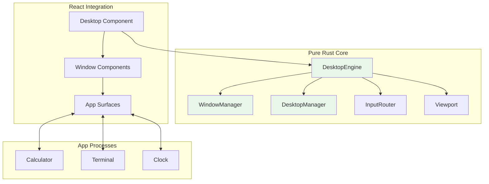
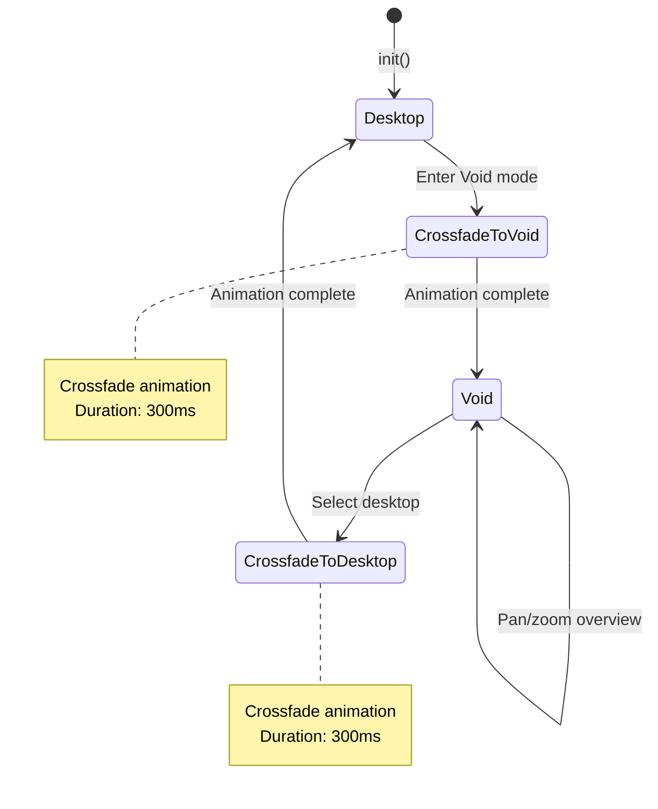
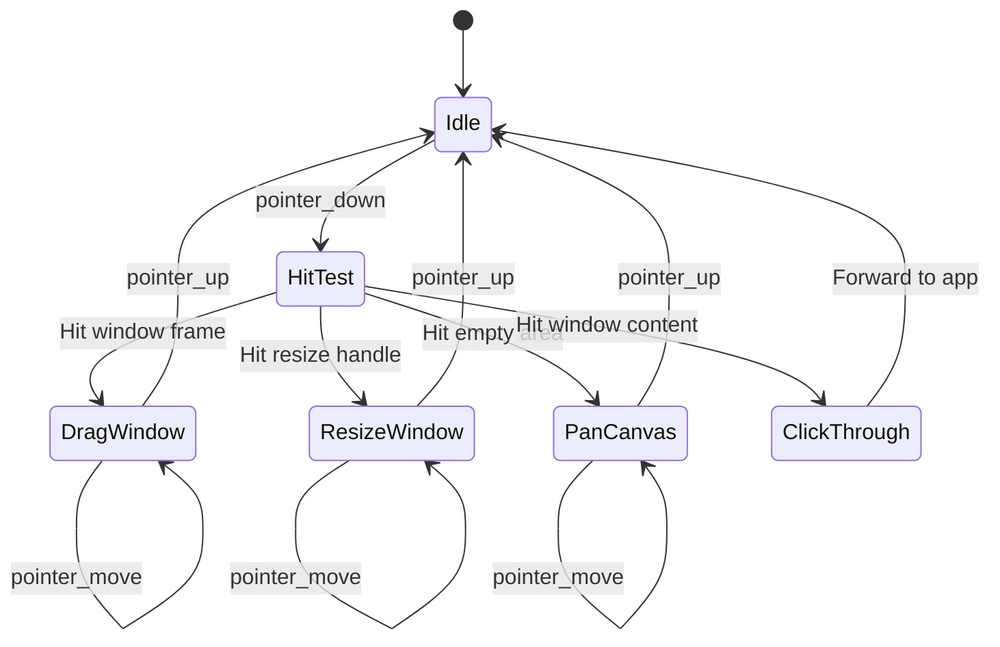

# 09 - Desktop Compositor

> Window management, input routing, and rendering for Zero OS.

## Overview

The Desktop Compositor manages the visual environment: windows, desktops (workspaces), input routing, and animated transitions. It's implemented as a pure Rust core with React integration for rendering.

### Goals

- **Pure Rust core**: All state management testable without browser
- **Infinite canvas**: Multiple desktops with pan/zoom navigation
- **Smooth transitions**: Animated desktop switching and window operations
- **Input routing**: Mouse/keyboard events routed to correct windows

### Non-Goals

- GPU acceleration (Phase 1 - uses CSS/React)
- 3D effects
- Multiple monitors (Phase 1)

## Architecture Diagram



## Core Types

### DesktopEngine

The `DesktopEngine` struct coordinates all desktop components. Its implementation is split across focused submodules for maintainability:

```rust
/// Main entry point for desktop operations
pub struct DesktopEngine {
    pub(crate) view_mode: ViewMode,
    pub(crate) void_state: VoidState,
    pub(crate) viewport: Viewport,
    pub(crate) windows: WindowManager,
    pub(crate) desktops: DesktopManager,
    pub(crate) input: InputRouter,
    pub(crate) crossfade: Option<Crossfade>,
    pub(crate) camera_animation: Option<CameraAnimation>,
    pub(crate) last_activity_ms: f64,
    pub(crate) window_cameras: HashMap<WindowId, Camera>,  // Per-window camera memory
}
```

### DesktopEngine Submodule Organization

| File | Methods |
|------|---------|
| `mod.rs` | Core: `new`, `init`, `resize`, `pan`, `zoom_at`, `active_camera`, accessors |
| `windows.rs` | Window lifecycle: `create_window`, `close_window`, `focus_window`, `move_window`, `resize_window`, `launch_app` |
| `pointer_events.rs` | Input handling: `handle_pointer_down`, `handle_pointer_move`, `handle_pointer_up`, `handle_wheel` |
| `void_mode.rs` | Void transitions: `enter_void`, `exit_void` |
| `transitions.rs` | Animation ticking: `tick_transition`, `layer_opacities`, `is_crossfading`, `is_animating` |
| `animation.rs` | Camera animation: `pan_to_window` |
| `rendering.rs` | Screen calculations: `get_window_screen_rects` |

### Type Aliases

```rust
// crates/zos-desktop/src/types.rs

/// Unique window identifier (64-bit, globally unique)
pub type WindowId = u64;

/// Unique desktop identifier (32-bit, globally unique)
pub type DesktopId = u32;
```

### Error Types

```rust
// crates/zos-desktop/src/error.rs

/// Errors that can occur in desktop compositor operations
pub enum DesktopError {
    WindowNotFound(WindowId),
    DesktopNotFound(DesktopId),
    DesktopIndexOutOfBounds { index: usize, count: usize },
    InvalidOperation { op: &'static str, reason: &'static str },
    SerializationError(String),
    RenderError(String),
    PersistenceError(String),
}

/// Result type alias for desktop operations
pub type DesktopResult<T> = Result<T, DesktopError>;
```

### Per-Window Camera Memory

The `window_cameras` field stores camera positions for each window, enabling "remember where I was" behavior when switching between windows:

```rust
impl DesktopEngine {
    pub fn focus_window(&mut self, id: WindowId) {
        // Save current camera for previous focused window
        if let Some(prev_id) = self.windows.focused() {
            self.window_cameras.insert(prev_id, self.active_camera());
        }
        
        // Focus new window
        self.windows.focus(id);
        
        // Restore camera if we have a saved position
        if let Some(camera) = self.window_cameras.get(&id) {
            self.viewport.set_camera(*camera);
        }
    }
}
```

### Window Types

```rust
pub struct Window {
    pub id: WindowId,
    pub desktop_id: DesktopId,
    pub title: String,
    pub position: Vec2,
    pub size: Size,
    pub z_order: u32,
    pub state: WindowState,
    pub window_type: WindowType,
    pub app_id: String,
    pub pid: Option<u32>,
}

pub enum WindowState {
    Normal,
    Minimized,
    Maximized,
    Focused,
}

pub enum WindowType {
    Normal,
    Dialog,
    System,
}

pub struct WindowConfig {
    pub title: String,
    pub position: Option<Vec2>,
    pub size: Size,
    pub app_id: String,
    pub window_type: WindowType,
    pub process_id: Option<u32>,
}
```

### Desktop Types

```rust
pub struct Desktop {
    pub id: DesktopId,
    pub name: String,
    pub camera: Camera,
}

pub struct Camera {
    pub x: f32,
    pub y: f32,
    pub zoom: f32,
}

pub enum ViewMode {
    Desktop,   // Normal desktop view
    Void,      // Overview of all desktops
}

pub struct VoidState {
    pub camera: Camera,
    pub selected_desktop: Option<DesktopId>,
}
```

### Math Types

```rust
pub struct Vec2 {
    pub x: f32,
    pub y: f32,
}

pub struct Size {
    pub width: f32,
    pub height: f32,
}

pub struct Rect {
    pub x: f32,
    pub y: f32,
    pub width: f32,
    pub height: f32,
}
```

## State Machine

### View Mode Transitions



### Drag State Machine



## Input Routing

### Hit Testing

```rust
pub struct InputRouter {
    drag_state: DragState,
}

pub enum DragState {
    Idle,
    DraggingWindow { window_id: WindowId, offset: Vec2 },
    ResizingWindow { window_id: WindowId, edge: ResizeEdge },
    PanningCanvas { start: Vec2 },
}

pub enum InputResult {
    /// Event consumed by desktop
    Consumed,
    /// Forward to window
    ForwardToWindow(WindowId),
    /// No action needed
    None,
}
```

### Window Regions

```rust
pub enum WindowRegion {
    /// Title bar (draggable)
    TitleBar,
    /// Close button
    CloseButton,
    /// Minimize button
    MinimizeButton,
    /// Maximize button
    MaximizeButton,
    /// Resize edges
    ResizeEdge(ResizeEdge),
    /// Window content
    Content,
    /// Outside window
    Outside,
}

pub enum ResizeEdge {
    Top,
    Bottom,
    Left,
    Right,
    TopLeft,
    TopRight,
    BottomLeft,
    BottomRight,
}
```

## Animations

### Crossfade

Desktop-to-Void transitions use crossfade:

```rust
pub struct Crossfade {
    pub direction: CrossfadeDirection,
    pub progress: f32,
    pub start_time: f64,
    pub duration_ms: u32,
}

pub enum CrossfadeDirection {
    ToVoid,
    ToDesktop,
}

pub const CROSSFADE_DURATION_MS: u32 = 300;
```

### Camera Animation

Pan/zoom uses eased animations:

```rust
pub struct CameraAnimation {
    pub start_camera: Camera,
    pub end_camera: Camera,
    pub start_time: f64,
    pub duration_ms: u32,
}

pub const CAMERA_ANIMATION_DURATION_MS: u32 = 300;
```

### Easing

```rust
/// Ease-out cubic for smooth deceleration
pub fn ease_out_cubic(t: f32) -> f32 {
    let t = t - 1.0;
    t * t * t + 1.0
}
```

## Persistence

### Snapshot Format

```rust
pub struct Snapshot {
    pub desktops: Vec<PersistedDesktop>,
    pub windows: Vec<PersistedWindow>,
    pub active_desktop: DesktopId,
    pub view_mode: ViewMode,
}

pub struct PersistedDesktop {
    pub id: DesktopId,
    pub name: String,
    pub camera: Camera,
}

pub struct PersistedWindow {
    pub id: WindowId,
    pub desktop_id: DesktopId,
    pub title: String,
    pub position: Vec2,
    pub size: Size,
    pub app_id: String,
    pub z_order: u32,
}
```

### Storage

Snapshots stored via VFS at `/system/config/desktop.json`.

## Window Frame

### Frame Constants

```rust
pub struct FrameStyle {
    pub title_bar_height: f32,  // 30.0
    pub border_width: f32,       // 2.0
    pub resize_handle_size: f32, // 8.0
    pub button_size: f32,        // 24.0
}
```

### Frame Regions

```
┌─────────────────────────────────────────────────┐
│  [_] [□] [×]        Title Bar                   │  ← 30px
├─────────────────────────────────────────────────┤
│                                                 │
│                                                 │
│               Content Area                      │
│           (App Surface renders here)            │
│                                                 │
│                                                 │
└─────────────────────────────────────────────────┘
                                                  ↑
                                            Resize handles (8px)
```

## React Integration

### Component Structure

```
<DesktopProvider>
  <Desktop>
    <WindowLayer>
      <Window id={1}>
        <WindowFrame>
          <AppSurface app_id="calculator" />
        </WindowFrame>
      </Window>
      <Window id={2}>
        ...
      </Window>
    </WindowLayer>
    <VoidOverlay /> {/* When in Void mode */}
  </Desktop>
</DesktopProvider>
```

### WASM Bindings

```rust
#[wasm_bindgen]
impl DesktopEngine {
    #[wasm_bindgen(constructor)]
    pub fn new() -> Self;
    
    #[wasm_bindgen]
    pub fn init(&mut self, width: f32, height: f32);
    
    #[wasm_bindgen]
    pub fn create_window(&mut self, config: JsValue) -> u64;
    
    #[wasm_bindgen]
    pub fn get_windows_json(&self) -> String;
    
    #[wasm_bindgen]
    pub fn handle_pointer_down(&mut self, x: f32, y: f32, time: f64) -> String;
}
```

## Invariants

| # | Invariant | Enforcement |
|---|-----------|-------------|
| 20 | All cross-domain uses IPC | Window ↔ App communication via IPC |

## Implementation References

| Component | Source File | Description |
|-----------|-------------|-------------|
| DesktopEngine | `crates/zos-desktop/src/engine/mod.rs` | Core engine + accessors |
| Engine windows | `crates/zos-desktop/src/engine/windows.rs` | Window lifecycle methods |
| Engine input | `crates/zos-desktop/src/engine/pointer_events.rs` | Input handling |
| Engine void | `crates/zos-desktop/src/engine/void_mode.rs` | Void transitions |
| Engine transitions | `crates/zos-desktop/src/engine/transitions.rs` | Animation ticking |
| Engine animation | `crates/zos-desktop/src/engine/animation.rs` | Camera animation |
| Engine rendering | `crates/zos-desktop/src/engine/rendering.rs` | Screen calculations |
| Type aliases | `crates/zos-desktop/src/types.rs` | WindowId, DesktopId |
| Error types | `crates/zos-desktop/src/error.rs` | DesktopError, DesktopResult |
| WindowManager | `crates/zos-desktop/src/window/manager.rs` | Window storage |
| Window types | `crates/zos-desktop/src/window/types.rs` | Window, WindowState |
| DesktopManager | `crates/zos-desktop/src/desktop/manager.rs` | Desktop storage |
| Desktop types | `crates/zos-desktop/src/desktop/types.rs` | Desktop struct |
| ViewMode | `crates/zos-desktop/src/desktop/view_mode.rs` | Desktop/Void mode |
| InputRouter | `crates/zos-desktop/src/input/mod.rs` | Input routing |
| Viewport | `crates/zos-desktop/src/viewport.rs` | Camera transforms |
| Transitions | `crates/zos-desktop/src/transition/` | Crossfade, camera, easing |
| Math | `crates/zos-desktop/src/math/` | Vec2, Size, Rect, Camera |
| Persistence | `crates/zos-desktop/src/persistence/` | State serialization |
| WASM bindings | `crates/zos-desktop/src/wasm.rs` | React integration |

## Related Specs

- [08-applications.md](08-applications.md) - Apps render in window surfaces
- [04-init-supervisor.md](04-init-supervisor.md) - Supervisor spawns terminal windows
