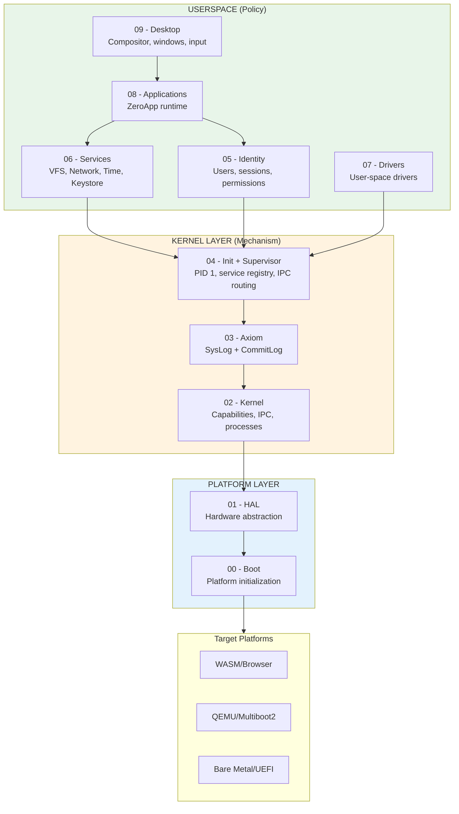
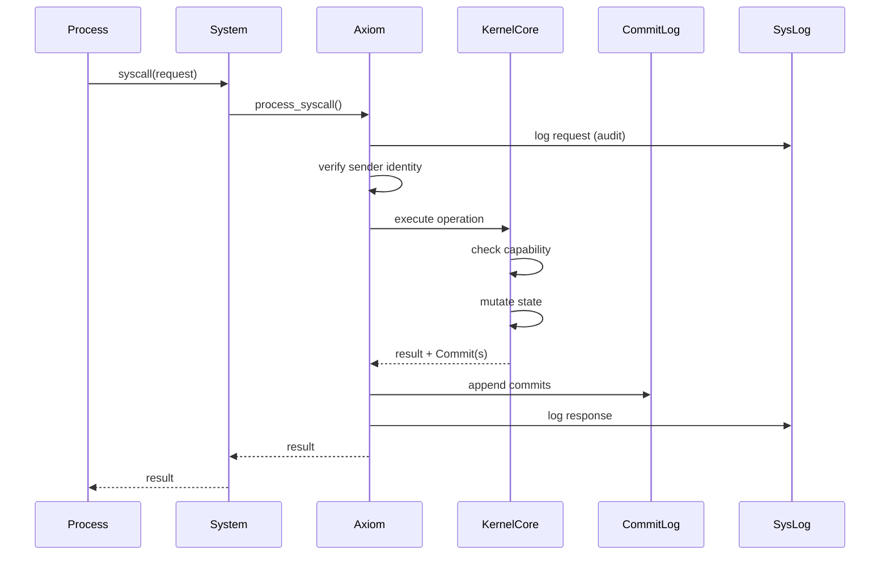

# Zero OS Specification v0.1.3

> A capability-based microkernel operating system with deterministic state via commit log.

## Overview

Zero OS is designed around three fundamental principles:

1. **Capability-Based Security**: All resource access is mediated by unforgeable capability tokens. No ambient authority exists.
2. **Deterministic Replay**: All state mutations are recorded in a CommitLog. System state is always `reduce(genesis, commits)`.
3. **Minimal Trusted Computing Base**: The kernel remains under 3,000 LOC, forcing all policy and services into userspace.

This specification documents the **current implementation** of Zero OS v0.1.3, organized by architectural layer from boot through desktop.

### Goals

- Single codebase targeting WASM (Phase 1), QEMU (Phase 2), and bare metal (Phase 3)
- Auditable system—every syscall logged, every state change recorded
- Verifiable kernel small enough for formal methods
- Clean separation between mechanism (kernel) and policy (userspace)

### Non-Goals

- POSIX compatibility
- Legacy driver support
- Real-time guarantees (initial phases)

---

## Architecture Diagram



---

## Syscall Flow

Every syscall flows through Axiom for verification and recording:



**Key invariant**: No process ever directly invokes `KernelCore`. All access is mediated through `System` which routes through `Axiom`.

---

## Two-Log Model

| Log | Purpose | Replay | Contents |
|-----|---------|--------|----------|
| **SysLog** | Audit trail | No | Request/response pairs for every syscall |
| **CommitLog** | State mutations | Yes | Only successful state changes |

The CommitLog is the **source of truth**. SysLog can be deleted without losing system state.

```
State = reduce(genesis_state, CommitLog) → current_state
```

---

## Core Invariants

These architectural constraints are **non-negotiable** across all targets:

| # | Invariant | Description |
|---|-----------|-------------|
| 1 | **All Authority Through Axiom** | No process may directly invoke the kernel. Axiom verifies, logs, and gates all syscalls. |
| 2 | **State Mutated Only by Commits** | All kernel state changes are atomic Commits appended to an immutable CommitLog. |
| 4 | **Kernel Minimality** | Kernel implements only: IPC, scheduling, address spaces, capability enforcement, commit emission. |
| 5 | **3,000 LOC Limit** | The kernel must remain ≤ 3,000 lines of executable code. |
| 7 | **No Policy in Kernel** | Kernel enforces mechanism only. No paths, identities, permissions, or security labels. |
| 13 | **Supervisor Is Thin Transport** | Supervisor only relays data between web client and processes via IPC. No policy, no authority. |
| 17 | **Capabilities Are Primitive** | Capabilities reference kernel objects only: endpoints, processes, memory, IRQs, I/O ports. |
| 31 | **Filesystem Through VFS** | All filesystem access must flow through VFS Service (PID 4). |
| 32 | **Keystore Physically Separate** | Cryptographic keys stored in separate `zos-keystore` database, not through VFS. |

See [docs/invariants/invariants.md](../../invariants/invariants.md) for the complete list.

---

## Specification Sections

### Platform Layer

| Section | Description | Status |
|---------|-------------|--------|
| [00-boot.md](00-boot.md) | Bootstrap sequence per platform (WASM, QEMU, UEFI) | ✓ Complete |
| [01-hal.md](01-hal.md) | Hardware Abstraction Layer trait and platform capabilities | ✓ Complete |

### Kernel Layer

| Section | Description | Status |
|---------|-------------|--------|
| [02-kernel.md](02-kernel.md) | Microkernel: capabilities, IPC, processes, syscalls | ✓ Complete |
| [03-axiom.md](03-axiom.md) | Verification layer: SysLog, CommitLog, gateway pattern | ✓ Complete |
| [04-init-supervisor.md](04-init-supervisor.md) | Init (PID 1), service registry, supervisor boundary | ✓ Complete |

### Userspace Layer

| Section | Description | Status |
|---------|-------------|--------|
| [05-identity.md](05-identity.md) | Users, sessions, Zero-ID, permissions, neural keys | ✓ Complete |
| [06-services.md](06-services.md) | VFS, Network, Time, Keystore services | ✓ Complete |
| [07-drivers.md](07-drivers.md) | User-space driver model (future) | ✓ Complete |
| [08-applications.md](08-applications.md) | ZeroApp trait, manifests, app runtime | ✓ Complete |
| [09-desktop.md](09-desktop.md) | Compositor, windows, input, React surfaces | ✓ Complete |

---

## Key Changes from v0.1.2

### 1. QEMU Native Runtime

Full x86_64 platform support with:
- `bootloader` crate integration (replaces raw multiboot2 assembly)
- `X86_64Hal` implementation: serial, GDT, IDT, VMM, APIC, VirtIO
- WASM runtime (`wasmi`) for executing service binaries
- Embedded WASM binaries via `include_bytes!()`
- CommitLog persistence to VirtIO block storage
- Boot-time replay verification via `replay_and_verify()`

### 2. Pure Microkernel Spawn Model

New syscalls for QEMU:
- `SYS_LOAD_BINARY` (0x16): Load embedded WASM binary by name
- `SYS_SPAWN_PROCESS` (0x17): Spawn process from binary
- Init uses these syscalls directly on QEMU, falls back to Supervisor async flow on WASM

### 3. Service PID Corrections

Updated to match actual boot order:
- PID 2: PermissionService
- PID 3: VfsService  
- PID 4: KeystoreService
- PID 5: IdentityService
- PID 6: TimeService

### 4. Identity Layer Updates

- `MachineKeyCapabilities` now uses string array format (`["AUTHENTICATE", "SIGN", ...]`)
- New capability constants: `SVK_UNWRAP`, `MLS_MESSAGING`, `VAULT_OPERATIONS`
- `MachineKeyRecord` adds: `signing_sk`, `encryption_sk`, `key_scheme`, PQ key fields
- `EncryptedShardStore` for Neural Key shard storage

### 5. Desktop Engine Refactoring

- `impl` blocks split into focused submodules: `windows.rs`, `pointer_events.rs`, `void_mode.rs`, `transitions.rs`, `animation.rs`, `rendering.rs`
- New `error.rs` with `DesktopError` and `DesktopResult` types
- New `types.rs` with `WindowId` and `DesktopId` type aliases
- `window_cameras: HashMap<WindowId, Camera>` for per-window camera memory

### 6. Terminal Spawning Change

Terminal is no longer auto-spawned at boot. Each terminal window is spawned by the Desktop component via `launchTerminal()`, enabling process isolation per window.

---

## System Struct Architecture

The `System<H>` struct is the canonical entry point for all kernel operations:

```rust
pub struct System<H: HAL> {
    pub axiom: AxiomGateway,   // Verification layer
    pub kernel: KernelCore<H>, // Execution layer
}

impl<H: HAL> System<H> {
    /// THE entry point for all syscalls
    pub fn process_syscall(&mut self, pid: ProcessId, syscall: &[u8]) -> SyscallResult;
}
```

This architecture ensures Axiom and Kernel remain **separate concerns**:
- `Axiom`: Verification, logging, audit
- `KernelCore`: Execution, capability enforcement, state mutation

---

## Platform Capabilities

| Capability | WASM | QEMU | Bare Metal |
|------------|------|------|------------|
| Process isolation | Web Workers + WASM sandbox | WASM sandbox (wasmi) | Hardware MMU |
| Preemption | Cooperative | APIC timer interrupt | Timer interrupt |
| Memory protection | WASM linear memory | WASM + page tables | Page tables |
| Storage | IndexedDB | VirtIO-blk | NVMe/SATA |
| Network | Fetch/WebSocket | VirtIO-net | NIC drivers |
| Scheduling | Single-threaded | Cooperative (WASM) | Multi-core |
| Binary loading | Network fetch (async) | Embedded (include_bytes!) | Disk/EFI |
| CommitLog persistence | None (in-memory) | VirtIO-blk | Disk |

---

## Well-Known Processes

| PID | Process | Spawned By | Purpose |
|-----|---------|------------|---------|
| 0 | Supervisor/Kernel | Bootstrap | Transport boundary (WASM) / Kernel (QEMU) |
| 1 | Init | Supervisor/Kernel | Service registry, IPC routing |
| 2 | PermissionService | Init | Permission policy enforcement |
| 3 | VfsService | Init | Virtual filesystem |
| 4 | KeystoreService | Init | Cryptographic key storage |
| 5 | IdentityService | Init | User/session management |
| 6 | TimeService | Init | Time settings |

> **Note**: PIDs are assigned in boot sequence order. Terminal is spawned per-window by Desktop, not at boot.

---

## Crate Map

| Crate | Layer | Purpose |
|-------|-------|---------|
| `zos-boot` | Platform | Kernel heap allocator, uses `bootloader` crate |
| `zos-hal` | Platform | HAL trait + x86_64 implementation (VMM, APIC, VirtIO, WASM runtime) |
| `zos-kernel-core` | Kernel | Core kernel primitives (pure state machine) |
| `zos-kernel` | Kernel | Kernel implementation + System struct |
| `zos-axiom` | Kernel | SysLog, CommitLog, gateway, replay |
| `zos-init` | Kernel | Init process (PID 1), pure microkernel spawn model |
| `zos-ipc` | Kernel | Syscall numbers, IPC constants |
| `zos-supervisor` | Kernel | WASM supervisor (browser platform) |
| `zos-process` | Userspace | Process-side syscall library |
| `zos-identity` | Userspace | Identity service client, key types |
| `zos-vfs` | Userspace | Virtual filesystem client |
| `zos-services` | Userspace | Core system services (VFS, Keystore, Identity, Time) |
| `zos-apps` | Userspace | ZeroApp trait and built-in apps |
| `zos-desktop` | Userspace | Window compositor, input routing, animations |
| `zos-network` | Userspace | Network service |

---

## Document Template

Each specification file follows this structure:

1. **Overview** — High-level description, goals, non-goals
2. **Architecture Diagram** — Mermaid diagram showing component relationships
3. **Interfaces** — Rust trait definitions, type signatures
4. **State Machine** — Mermaid stateDiagram for lifecycle/states
5. **IPC Protocol** — Message types, syscall numbers (where applicable)
6. **Invariants** — Properties that must always hold
7. **Platform Notes** — WASM/QEMU/Bare Metal differences
8. **Implementation References** — Links to source files
9. **Related Specs** — Cross-references to other sections

---

## Implementation References

| Component | Source |
|-----------|--------|
| System struct | `crates/zos-supervisor/src/system.rs` |
| Axiom gateway | `crates/zos-axiom/src/` |
| Kernel core | `crates/zos-kernel-core/src/` |
| HAL trait | `crates/zos-hal/src/lib.rs` |
| Init process | `crates/zos-init/src/` |
| Desktop engine | `crates/zos-desktop/src/` |
| IPC constants | `crates/zos-ipc/src/lib.rs` |

---

## Related Documentation

| Document | Description |
|----------|-------------|
| [Invariants](../../invariants/invariants.md) | Non-negotiable architectural constraints |
| [Whitepaper](../../whitepaper/) | Design principles and rationale |
| [TLA+ Specs](../../tla/) | Formal specifications |

---

## Version History

| Version | Date | Key Changes |
|---------|------|-------------|
| v0.1.3 | 2026-01 | QEMU native runtime, X86_64Hal, pure microkernel spawn, CommitLog replay, identity refactoring, desktop submodules |
| v0.1.2 | 2025-12 | Keystore separation, VFS hierarchy enforcement |
| v0.1.1 | 2025-11 | Desktop/Supervisor separation, Axiom gateway pattern |
| v0.1.0 | 2025-10 | Initial specification |
